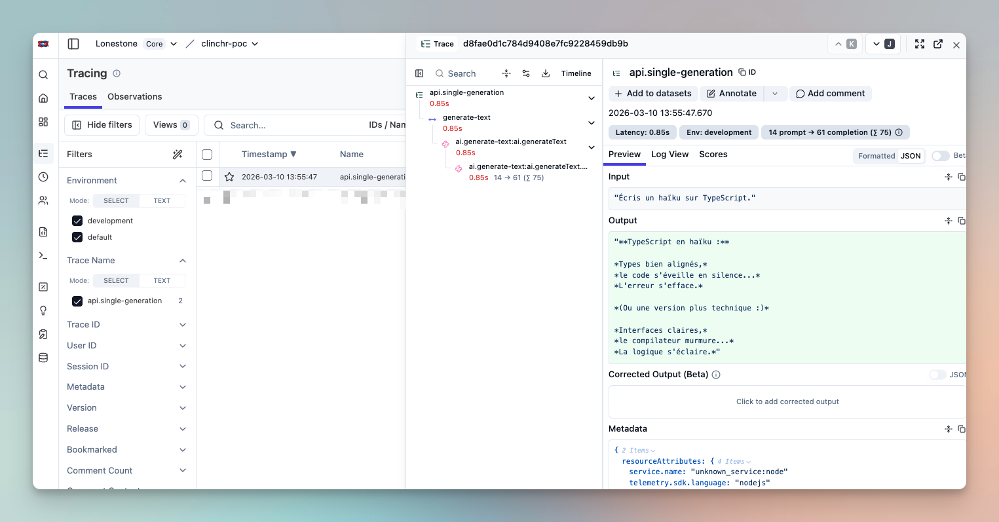
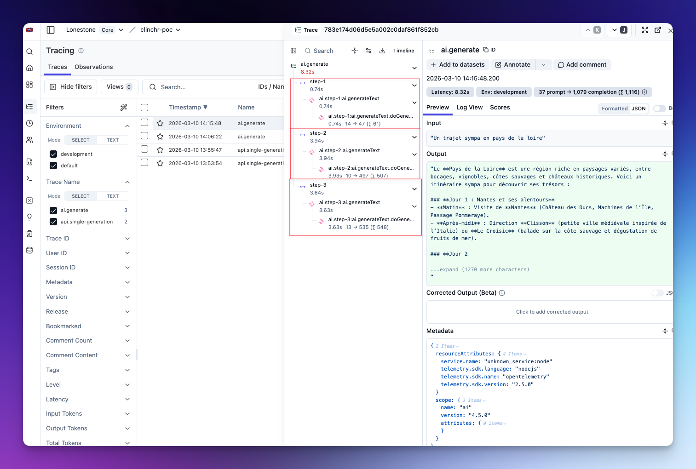
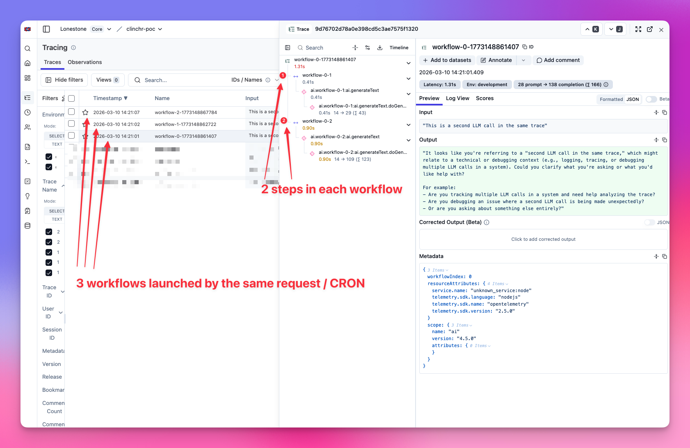
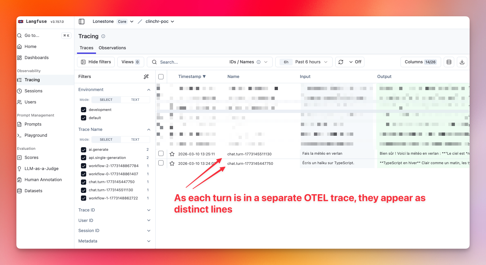
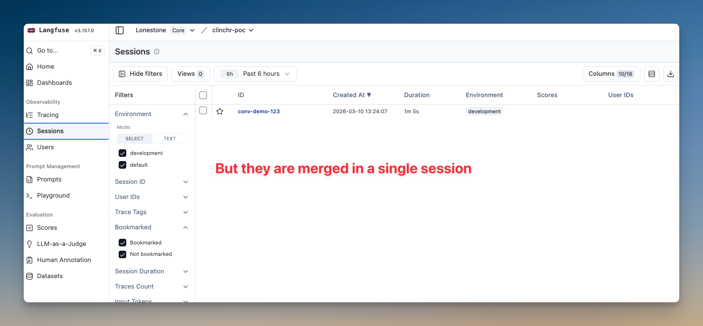
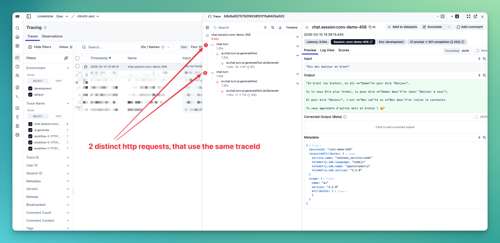

import { Aside } from '@astrojs/starlight/components';

# ❓ How it works

This brick is heavily opinionated. It combines:

- [Langfuse](https://langfuse.com/) for prompts management (storage, versioning, combining, etc.) and trace management
- [Vercel AI SDK](https://sdk.vercel.ai/) for the LLM calls
- A custom AI Module in the API, which provides a service to generate text, objects and chat with LLMs.

<Aside type="note" title="Langfuse is optional">
You can remove it (LangfuseService) from the codebase and use the Vercel AI SDK directly, and manage prompts as you see fit. Telemetry will still work via OTEL, and you will still see traces in Sentry.
</Aside>

## Prompt management - Langfuse
Langfuse can be self hosted, and is entirely open source. See [their docs](https://langfuse.com/docs) for more advanced usage.

Langfuse allows us to create, version and fetch prompts. 

We found it was a better solution than storing the prompts in the codebase, as it allows the whole team to contribute to the prompts (including non developers) and to change a prompt without deploying the codebase.

## LLM calls - Vercel AI SDK

The Vercel AI SDK allows us to easily call LLMs accross providers and is natively OpenTelemetry compatible via the `experimental_telemetry` option.

## Tracing Architecture - OpenTelemetry

The **Vercel AI SDK is OpenTelemetry compatible** and automatically emits spans for all LLM calls. Both Sentry and Langfuse simply pick up these spans through the shared TracerProvider, no additional instrumentation is required.

The tracing system is initialized in `apps/api/src/instrument.ts` before the NestJS application starts. The shared TracerProvider uses:
- **LangfuseSpanProcessor**: Filters and exports only LLM-related spans (instrumentation scope: `langfuse-sdk` or `ai`) to Langfuse
- **SentrySpanProcessor**: Receives all spans for application monitoring in Sentry

<Aside type="tip" title="AI Traces in Sentry">
Because the Vercel AI SDK emits OTEL spans and both processors receive them, **AI traces appear in both Langfuse and Sentry**. This allows you to:
- See AI calls in the context of full HTTP request traces
- Correlate AI performance issues with other application metrics
- Debug issues where AI calls are part of a larger workflow

See the [Monitoring documentation](/lonestone-boilerplate/core-features/2_monitoring) for details on the shared TracerProvider setup and how to optimize trace sampling in production.
</Aside>


# 📝 How to use

- Create the Langfuse project in your Langfuse dashboard
- Setup the necessary env variables (`LANGFUSE_SECRET_KEY`, optionally `LANGFUSE_PUBLIC_KEY` and `LANGFUSE_BASE_URL`, plus at least one provider key like `OPENAI_API_KEY`) in the `api/.env` file.
- You are good to go!

## Organizing Traces

By default, all LLM calls are grouped into the same OTEL trace. An OTEL trace starts on a HTTP requests or a CRON job. All children spans are grouped into this trace.

But that may not be convenient for your use case. Imagine a CRON job that loops on a hugh list of items: you may want to have 1 line per item in Langfuse UI, not a giant trace with hundreds of lines.

On Sentry's side, there's not much we can do. But with Langfuse however, we have more control on span/trace grouping and naming.

<Aside type="tip" title="OTEL trace in Langfuse">
Because we are filtering the spans that are sent to Langfuse, the spans are "orphaned" from the OTEL trace. This means you won't see "GET /api/your_route" as the trace name on Langfuse.

**Without more work, all the spans would simply be unnamed, making it hard to search and browse traces.**

That's why the next section is important if you want to log and debug your llm calls in Langfuse.
</Aside>

You can organize AI calls into meaningful traces using the `telemetry` option:

- **`traceMode`**: Controls grouping behavior.
  - `inherit` reuses the current OTEL trace context (default).
  - `split` creates a dedicated Langfuse trace for this call by injecting a specific `traceId`.
  - For `chat`, when telemetry is provided and `traceMode` is omitted, the default is `split`.
- **`traceId`**: Optional explicit trace ID in split mode. Reuse it if you want several calls to belong to the same split trace.
  This is applied through `parentSpanContext` in Langfuse tracing (not through Vercel telemetry fields).
- **`traceName`**: Display name for the Langfuse trace. This is only for readability in the UI.
- **`spanName`**: Span name for the current LLM call. Internally, this is forwarded to Vercel telemetry as `functionId`.
- **`sessionId`**: Groups multiple traces into a Langfuse Session (best for chat or long workflows split into many traces).
- **`metadata`**: Trace/span metadata for filtering and analysis (job IDs, user IDs, step IDs, etc.).
- **`langfuseOriginalPrompt`**: Preserves the original prompt before enhancements (useful for debugging).

## Recommended use-cases

### 1) Single-shot generation

Use `inherit` with a clear `traceName` + `spanName`:

```typescript
await aiService.generateText({
  prompt: 'Summarize this article',
  options: {
    telemetry: {
      traceMode: 'inherit',
      traceName: 'api.single-generation',
      spanName: 'ai.generate-text',
    },
  },
})

// Add more context to the trace, displayed in the row of the trace in Langfuse UI
this.langfuseService.finalizeTrace({
  input: body.prompt,
  output: result.result,
})
```



### 2) One API request, 3 LLM calls grouped

In this case, we can keep the same OTEL trace (as we want all the LLM calls to be grouped anyway), and finish with `finalizeTrace()` to add more context to the trace, displayed in the row of the trace in Langfuse UI:

```typescript
const results: string[] = []

const step1 = await aiService.generateText({
  prompt: 'Step 1',
  options: { telemetry: { traceMode: 'inherit', spanName: 'ai.step-1' } },
})
results.push(step1.result)

const step2 = await aiService.generateObject({
  prompt: 'Step 2',
  schema,
  options: { telemetry: { traceMode: 'inherit', spanName: 'ai.step-2' } },
})
results.push(step2.result)

const step3 = await aiService.generateText({
  prompt: 'Step 3',
  options: { telemetry: { traceMode: 'inherit', spanName: 'ai.step-3' } },
})
results.push(step3.result)

// Customize the input and output to display the relevant information in the row of the trace in Langfuse UI
// Beware that Langfuse UI input and output display is quite arbitrary, so I advice you build a nice string
langfuseService.finalizeTrace({
  name: `api.grouped-calls-${Date.now()}`,
  input: { prompts: ['Step 1', 'Step 2', 'Step 3'] },
  output: { results, status: 'done' },
})
```



### 3) Long-running job with 100 split sub-jobs

For one trace per sub-job (100 lines in trace list), use split mode and a unique `traceId` per sub-job:

```typescript
await aiService.generateText({
  prompt: subJobPrompt,
  options: {
    telemetry: {
      traceMode: 'split',
      traceId: await LangfuseService.createTraceId(`job:${jobId}:subjob:${subJobId}`),
      traceName: `job:${jobId}:subjob:${subJobId}`,
      spanName: 'ai.subjob.generate',
      metadata: { jobId, subJobId },
    },
  },
})
```

Advanced case (1 sub-job = several LLM calls): compute one `traceId` per sub-job and reuse it across all calls of that sub-job.



### 4) Chat

Use `split` per turn and reuse `sessionId` (conversation/thread ID):

```typescript
await aiService.chat({
  messages,
  options: {
    telemetry: {
      traceMode: 'split',
      traceId: await LangfuseService.createTraceId(`chat:${conversationId}:turn:${turnId}`),
      traceName: `chat.turn:${turnId}`,
      spanName: 'ai.chat.turn',
      sessionId: conversationId,
      metadata: { conversationId, turnId },
    },
  },
})
```

With this, each turn will be displayed as a separate line in Langfuse UI, and all the turns for the same conversation will be merged into a single session.





## Going further

Nothing stops you from using those different parameters in a more complex way.

For example, you may want to update the Langfuse trace for each new turn of a chat, instead of creating a new trace for each turn.

You can do this by using `traceMode: 'split'` and the same `traceId` for all the turns of the same conversation.

You may also want to use the session feature to group traces across requests for something else than a chat (e.g. a long-running job that loops on a huge list of items).

<Aside type="tip" title="Generating trace id">
Always use `await LangfuseService.createTraceId('your-trace-string')` to generate a trace id, as it ensures the trace id is unique and deterministic.
</Aside>




## Trace use-case examples

The API exposes five example endpoints that demonstrate each trace pattern. Call them under `POST /ai/examples/use-case-*` (see OpenAPI for request bodies):

| Use case | Endpoint | Description |
|----------|----------|-------------|
| 1. Single generation | `POST /ai/examples/use-case-1-single-generation` | One REST call, one LLM call; trace is finalized with name/output so Langfuse shows them. |
| 2. Grouped calls | `POST /ai/examples/use-case-2-grouped-calls` | One REST call, several LLM calls in one trace (inherit); finalizeTrace at end. |
| 3. Logical units | `POST /ai/examples/use-case-3-logical-units` | One REST call, each “workflow” gets its own trace (split per unit). |
| 4. Chat session | `POST /ai/examples/use-case-4-chat-session` | Chat with explicit `sessionId` to group traces across requests. |
| 5. Chat session with turns merged into a single trace | `POST /ai/examples/use-case-5-chat-session-with-turns-merged` | Chat with explicit `sessionId` to group traces across requests, and turns merged into a single trace. |


## API Reference

See the [AI module README](https://github.com/lonestone/lonestone-boilerplate/blob/main/apps/api/src/modules/ai/README.md) for detailed API documentation and usage patterns.

# 🧹 How to remove

1. Delete the `ai` module from the `api/src/modules` folder.
2. Remove Langfuse + AI SDK dependencies from `apps/api/package.json`:

```json
"@ai-sdk/anthropic",
"@ai-sdk/google",
"@ai-sdk/mcp",
"@ai-sdk/mistral",
"@ai-sdk/openai",
"@langfuse/client",
"@langfuse/otel",
"@langfuse/tracing",
"ai",
```

3. Remove Langfuse/provider env variables from `apps/api/.env`:

```
LANGFUSE_SECRET_KEY=
LANGFUSE_PUBLIC_KEY=
LANGFUSE_BASE_URL=
OPENAI_API_KEY=
GOOGLE_API_KEY=
MISTRAL_API_KEY=
ANTHROPIC_API_KEY=
```
