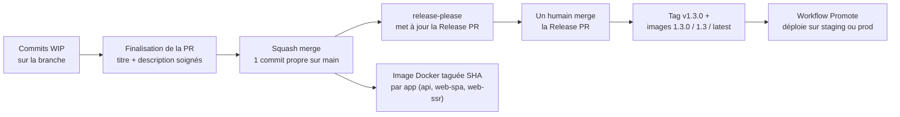
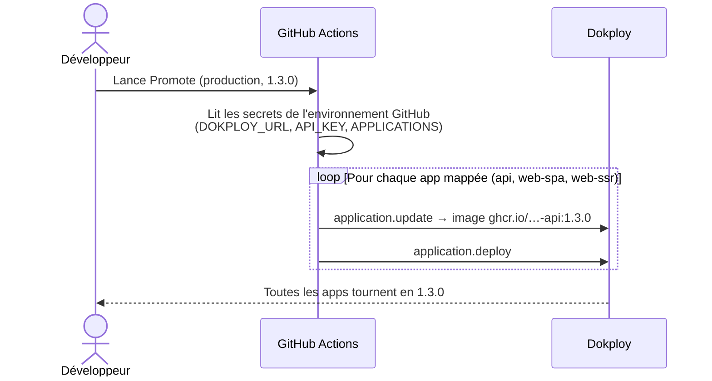

# Ce que cette PR introduit : contribution, versioning et release

Ce document explique, en français et sans jargon, ce que cette PR change pour l'équipe. Une version anglaise existe : [PRESENTATION.md](./PRESENTATION.md) — elle sert de base à la note de release. Le pourquoi détaillé de chaque décision vit dans la doc : [Contribution and release](../../../apps/documentation/src/content/docs/explanations/2_contribution-and-release.mdx).

## En une phrase

Cette PR met en place un système complet qui va de l'écriture du commit jusqu'au déploiement en production : des commits normés, un changelog généré automatiquement, des versions semver posées par un robot, des images Docker versionnées pour toutes les apps, et un bouton unique pour envoyer une version sur un environnement.

## Le problème de départ

Aujourd'hui, la plupart de nos projets fonctionnent en « merge sur `main` = déploiement ». C'est très bien en début de projet, mais ça pose des problèmes quand le projet mûrit :

1. **Le « pourquoi » des changements se perd.** Les messages de commit sont courts, la justification vit dans un commentaire de PR ou un fil Slack. Un an plus tard, quelqu'un annule un changement fait pour une bonne raison, parce que la raison n'était écrite nulle part.
2. **Pas de notion de version.** Impossible de dire « la prod tourne en 1.2.3 », de faire un changelog propre, ou de brancher des outils comme Sentry sur des releases.

## L'idée centrale

**Le message du commit de squash est la seule chose écrite à la main. Tout le reste en découle.**

Chaque PR est mergée en squash : un seul commit propre arrive sur `main`, avec un titre normé (Conventional Commits) et un corps qui explique le pourquoi. À partir de là, tout est automatique : le calcul de version, le changelog, les images Docker.

## Les briques, une par une

### 1. Des règles de contribution écrites et vérifiées

- `CONTRIBUTING.md` : le document de référence. Format des commits (Conventional Commits 1.0.0), format des titres et descriptions de PR, flow de squash merge.
- **commitlint + lefthook** : chaque message de commit est vérifié en local au moment du commit (lefthook remplace husky). Les scopes autorisés sont les domaines du projet, définis dans `commitlint.config.ts`.
- **Lint des PR en CI** (`pr-lint.yml`) : le titre et la description de la PR sont vérifiés avant merge, y compris une chasse aux mots type « wip » ou « fix stuff ». Pourquoi ? Parce qu'avec le squash merge, **le titre de la PR devient le message du commit** : il doit être propre avant de cliquer sur le bouton.

### 2. Le versioning automatique avec release-please

- À chaque merge sur `main`, [release-please](https://github.com/googleapis/release-please) maintient une **Release PR** : elle accumule les changements, calcule la prochaine version (semver, d'après les types de commits) et génère le `CHANGELOG.md`.
- **On n'édite plus jamais le** `CHANGELOG.md` **à la main.** C'est un inventaire généré : une ligne par changement, avec un lien vers le commit. Le pourquoi est dans le corps du commit, à un `git show` de distance.
- **La Release PR est mergée par un humain, jamais automatiquement.** Des checks verts veulent dire « cette PR a le droit de merger », pas « envoyez ça en prod ». C'est la porte de release.
- En plus du changelog, chaque release peut avoir une **note de release humaine** dans `apps/documentation/src/content/docs/releases/` : elle raconte pourquoi cette version existe. Le check CI (`release-note.yml`) est **optionnel par défaut** : il ne bloque la Release PR que si la variable de repo `REQUIRE_RELEASE_NOTE` vaut `true`. Le boilerplate l'active pour lui-même ; chaque projet choisit.

### 3. Des images Docker versionnées pour toutes les apps

Le workflow `push-to-ghcr.yml` construit désormais une image par app exécutable — **API, web-spa et web-ssr** — et pas seulement l'API. Si un Dockerfile manque (app supprimée du projet), il est simplement ignoré.

- Un push sur `main` produit une image taguée avec le SHA.
- Un tag `v*` produit `1.3.0`, `1.3` et `latest`.

Toutes les apps avancent donc à la même version : plus de situation où l'API est versionnée mais les frontends se construisent depuis une branche : on pourra diminuer la charge sur notre PAAS (Dokploy).

### 4. Le workflow Promote : déployer une version en un clic

Merger la Release PR publie le tag et les images, **mais ne déploie rien**. Le déploiement est une étape séparée : le workflow **Promote**, lancé à la main depuis GitHub (Actions → Promote → choisir l'environnement et la version).

- Staging et production sont deux GitHub Environments séparés : ils avancent indépendamment.
- On ne change plus jamais la version à la main dans Dokploy : le run du workflow est la trace de qui a promu quoi, et quand.
- Le workflow est écrit pour Dokploy ; pour un autre hébergeur, on garde le même principe (un run = un environnement mis à jour) en adaptant les appels API.

### 5. Les deux modes : tous les projets ne sont pas obligés de versionner

| Mode              | Vérification des commits    | Release                                                   |
| ----------------- | --------------------------- | --------------------------------------------------------- |
| **Sans versions** | commitlint uniquement       | n'existe pas — pas de Release PR                          |
| **Versionné**     | commitlint + semver complet | Release PR mergée par un humain, tag + images versionnées |

Un nouveau projet démarre **sans versions** : chaque merge part sur staging, c'est ce qu'on veut en début de projet. Quand le projet va en production, on active le mode versionné — les fichiers de config release-please sont déjà dans le template, il suffit de les brancher. Le pipeline de build est identique dans les deux modes.

### 6. Les intentions de migration s'écrivent dans la PR

Côté Boilerstone (le système de mise à jour du boilerplate), les intentions de migration ne s'écrivent plus au moment de la release mais **dans la PR qui introduit le changement**, dans `.boilerstone/migration-intentions/unreleased/`. C'est le développeur qui connaît le pourquoi, pas le mainteneur qui release cinq PR d'un coup.

- Un check CI (`intention-gate.yml`) exige soit un fichier d'intention, soit le label `no-intention` (tous les changements ne concernent pas les consumers).
- Au moment de la release, `pnpm boilerplate intentions promote` déplace les intentions staged vers leur emplacement final avec les bons identifiants.

### 7. Feature flags plutôt que cherry-pick

Quand deux changements mergés ne doivent pas partir en prod ensemble, la réponse est un feature flag, pas un cherry-pick. La PR ajoute une convention minimale : un helper `isFeatureEnabled` côté API, piloté par variable d'environnement, et un guide dans la doc. Le cherry-pick reste une échappatoire documentée dans le runbook du mainteneur.

### 8. Des skills pour les agents IA

Quatre skills accompagnent les cérémonies multi-étapes, pour Claude comme pour Cursor :

- **finalize-pr** : transformer les commits WIP en titre + description de squash propres.
- **project-release** : préparer une release sur un projet consumer (note de release, vérification des checks).
- **boilerstone-intention** : écrire l'intention de migration de la PR courante.
- **boilerstone-release** : préparer une release du boilerplate sur la Release PR.

## Ce que ça implique pour le boilerplate

- Le repo passe en **squash merge obligatoire** avec le titre/description de PR comme message de commit. Le script `./scripts/configure-github-repo.sh` applique les réglages GitHub (dry-run par défaut).
- Le mainteneur ne rédige plus le changelog : il **cure la Release PR** (promotion des intentions, note de release) puis la merge lui-même. Le runbook `.boilerstone/docs/release-maintainer-runbook.md` a été réécrit autour de ce flow.
- L'ancien workflow `changelog.yml` et les commandes CLI de changelog sont supprimés ; husky est remplacé par lefthook.
- Reste à faire après merge : créer le label `no-intention`, exiger les nouveaux checks sur `main`, et créer les GitHub Environments `staging`/`production` avec leurs secrets Dokploy.

## Ce que ça implique pour les projets consumers

- **Rien n'est cassé** : un projet existant continue de fonctionner tel quel. Les changements arrivent par le canal habituel : deux intentions de migration (« adopter les conventional commits » et « adopter release-please ») guideront la mise à niveau via Boilerstone.
- Les nouveaux projets créés depuis le template ont tout d'office : commitlint, lefthook, les workflows CI, et démarrent en mode « sans versions ».
- Chaque équipe choisit **par environnement** ce qu'il consomme : staging peut suivre `main`, la production tourne sur une version épinglée et n'avance que via Promote. Les recettes recommandées (et les pièges à éviter) sont dans la doc [Release and versioning](../../../apps/documentation/src/content/docs/references/1_release_and_versionning.mdx).
- Le `CONTRIBUTING.md` du template est à personnaliser légèrement (les scopes/domaines propres au projet).

## Ce qui a aussi été fait au passage

- Réécriture des docs Boilerstone (README, runbooks) pour les rendre plus courtes et plus lisibles.
- Deux nouvelles pages de doc : [Contribution and release](../../../apps/documentation/src/content/docs/explanations/2_contribution-and-release.mdx) (le pourquoi du système) et la refonte de [Release and versioning](../../../apps/documentation/src/content/docs/references/1_release_and_versionning.mdx) (le comment).
- Des règles d'écriture « plain English » pour les rapports d'agents dans `AGENTS.md` / `CLAUDE.md`.

## Pour aller plus loin

- [Contribution and release](../../../apps/documentation/src/content/docs/explanations/2_contribution-and-release.mdx) — la story complète, les décisions et leurs raisons.
- [Release and versioning](../../../apps/documentation/src/content/docs/references/1_release_and_versionning.mdx) — les deux modes, les recettes de déploiement, Promote.
- [CONTRIBUTING.md](../../../CONTRIBUTING.md) — les règles au quotidien.
- [scripts/github-repo-settings.md](../../../scripts/github-repo-settings.md) — la checklist des réglages GitHub.

