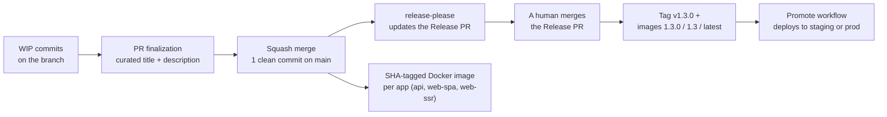
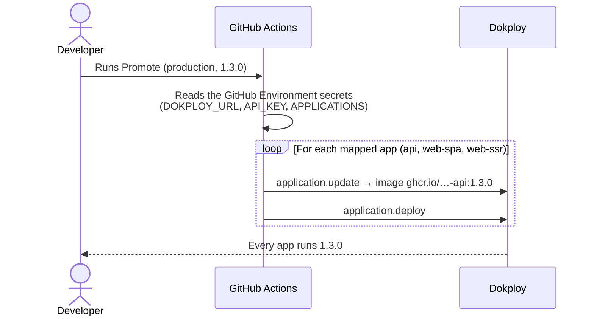

# What this PR introduces: contribution, versioning, and release

This document explains, in plain language, what this PR changes for the team. A French version exists: [PRESENTATION.fr.md](./PRESENTATION.fr.md). It is also the base material for the release note. The detailed "why" of every decision lives in the docs: [Contribution and release](../../../apps/documentation/src/content/docs/explanations/2_contribution-and-release.mdx).

## In one sentence

This PR sets up a complete system that goes from writing a commit to deploying in production: normalized commits, an automatically generated changelog, semver versions computed by a robot, versioned Docker images for every app, and a single button to send a version to an environment.

## The starting problem

Today, most of our projects work as "merge to `main` = deploy". That is fine early on, but it creates three problems as a project matures:

1. **The "why" of changes gets lost.** Commit messages are short, the justification lives in a PR comment or a Slack thread. A year later, someone reverts a change made for a good reason, because the reason was written nowhere.
2. **No notion of version.** Impossible to say "production runs 1.2.3", to build a clean changelog, or to plug tools like Sentry into releases.
3. **No gate between staging and production.** Everything merged goes to production, at the same pace.

## The core idea

**The squash commit message is the only thing written by hand. Everything else derives from it.**

Every PR is squash-merged: a single clean commit lands on `main`, with a normalized title (Conventional Commits) and a body that explains the why. From there, everything is automatic: version math, changelog, Docker images.

## The pieces, one by one

### 1. Written and enforced contribution rules

- **`CONTRIBUTING.md`**: the reference document. Commit format (Conventional Commits 1.0.0), PR title and description format, squash merge flow.
- **commitlint + lefthook**: every commit message is checked locally at commit time (lefthook replaces husky). The allowed scopes are the project's domains, defined in `commitlint.config.ts`.
- **PR lint in CI** (`pr-lint.yml`): the PR title and description are checked before merge, including a hunt for words like "wip" or "fix stuff". Why? Because with squash merge, **the PR title becomes the commit message** — it must be clean before anyone clicks the button.

### 2. Automatic versioning with release-please

- On every merge to `main`, [release-please](https://github.com/googleapis/release-please) maintains a **Release PR**: it accumulates changes, computes the next version (semver, from the commit types), and generates `CHANGELOG.md`.
- **We never edit `CHANGELOG.md` by hand again.** It is a generated inventory: one line per change, with a link to the commit. The why is in the commit body, one `git show` away.
- **The Release PR is merged by a human, never automatically.** Green checks mean "this PR is allowed to merge", not "send this to production". It is the release gate.
- On top of the changelog, each release can have a **human release note** in `apps/documentation/src/content/docs/releases/`: it tells why this version exists. The CI check (`release-note.yml`) is **optional by default**: it only blocks the Release PR when the repository variable `REQUIRE_RELEASE_NOTE` is `true`. The boilerplate enables it for itself; each project chooses.

### 3. Versioned Docker images for every app

The `push-to-ghcr.yml` workflow now builds one image per runnable app — **API, web-spa, and web-ssr** — not just the API. If a Dockerfile is missing (app removed from the project), it is simply skipped.

- A push to `main` produces a SHA-tagged image.
- A `v*` tag produces `1.3.0`, `1.3`, and `latest`.

All apps therefore move at the same version: no more situation where the API is versioned while the frontends build from a branch.

### 4. The Promote workflow: deploy a version in one click

Merging the Release PR publishes the tag and the images, **but deploys nothing**. Deploying is a separate step: the **Promote** workflow, run manually from GitHub (Actions → Promote → pick the environment and the version).

- Staging and production are two separate GitHub Environments: they move independently.
- We never change the version by hand in Dokploy anymore: the workflow run is the record of who promoted what, and when.
- The workflow is written for Dokploy; for another host, keep the same principle (one run = one environment updated) and adapt the API calls.
- Optional: set the repository variable `PROMOTE_ON_RELEASE` and Promote is dispatched automatically once the tag images are built — merging the Release PR becomes the deploy button. Add required reviewers on the environment to get an "Approve and deploy" pause instead of an immediate deploy.

### 5. The two modes: not every project has to version

| Mode | Commit checks | Release |
| --- | --- | --- |
| **Without versions** | commitlint only | does not exist — no Release PR |
| **Versioned** | commitlint + full semver | Release PR merged by a human, tag + versioned images |

A new project starts **without versions**: every merge goes to staging, which is what you want early on. When the project goes to production, you switch on the versioned mode — the release-please config files already ship with the template. The build pipeline is identical in both modes.

### 6. Migration intentions are written in the PR

On the Boilerstone side (the boilerplate upgrade system), migration intentions are no longer written at release time but **in the PR that introduces the change**, in `.boilerstone/migration-intentions/unreleased/`. The developer has the context; the maintainer releasing five PRs at once does not.

- A CI check (`intention-gate.yml`) requires either an intention file or the `no-intention` label (not every change concerns consumers).
- At release time, `pnpm boilerplate intentions promote` moves the staged intentions to their final location with the right identifiers.

### 7. Feature flags rather than cherry-picks

When two merged changes must not ship to production together, the answer is a feature flag, not a cherry-pick. The PR adds a minimal convention: an `isFeatureEnabled` helper on the API side, driven by an environment variable, and a guide in the docs. Cherry-picking remains a documented escape hatch in the maintainer runbook.

### 8. Skills for AI agents

Four skills support the multi-step ceremonies, for Claude and Cursor alike:

- **finalize-pr**: turn WIP commits into a clean squash title + description.
- **project-release**: prepare a release on a consumer project (release note, check verification).
- **boilerstone-intention**: write the migration intention for the current PR.
- **boilerstone-release**: prepare a boilerplate release on the Release PR.

## What this means for the boilerplate

- The repo switches to **mandatory squash merge** with the PR title/description as the commit message. The `./scripts/configure-github-repo.sh` script applies the GitHub settings (dry-run by default).
- The maintainer no longer writes the changelog: they **curate the Release PR** (intention promotion, release note) and merge it themselves. The `.boilerstone/docs/release-maintainer-runbook.md` runbook was rewritten around this flow.
- The old `changelog.yml` workflow and the changelog CLI commands are deleted; husky is replaced by lefthook.
- Remaining after merge: create the `no-intention` label, require the new checks on `main`, set the `REQUIRE_RELEASE_NOTE` variable, and create the `staging`/`production` GitHub Environments with their Dokploy secrets.

## What this means for consumer projects

- **Nothing breaks**: an existing project keeps working as is. The changes arrive through the usual channel: two migration intentions ("adopt conventional commits" and "adopt release-please") will guide the upgrade via Boilerstone.
- New projects created from the template get everything out of the box: commitlint, lefthook, the CI workflows, and they start in "without versions" mode.
- Each team chooses **per environment** what it consumes: staging can follow `main`, production runs a pinned version and only moves via Promote. The recommended recipes (and the traps to avoid) are in the [Release and versioning](../../../apps/documentation/src/content/docs/references/1_release_and_versionning.mdx) doc.
- The template's `CONTRIBUTING.md` needs light personalization (the project's own scopes/domains).

## Also done along the way

- Rewrote the Boilerstone docs (README, runbooks) to be shorter and more readable.
- Two new doc pages: [Contribution and release](../../../apps/documentation/src/content/docs/explanations/2_contribution-and-release.mdx) (the why of the system) and a reworked [Release and versioning](../../../apps/documentation/src/content/docs/references/1_release_and_versionning.mdx) (the how).
- "Plain English" writing rules for agent reports in `AGENTS.md` / `CLAUDE.md`.

## To go further

- [Contribution and release](../../../apps/documentation/src/content/docs/explanations/2_contribution-and-release.mdx) — the full story, the decisions, and their reasons.
- [Release and versioning](../../../apps/documentation/src/content/docs/references/1_release_and_versionning.mdx) — the two modes, the deploy recipes, Promote.
- [CONTRIBUTING.md](../../../CONTRIBUTING.md) — the day-to-day rules.
- [scripts/github-repo-settings.md](../../../scripts/github-repo-settings.md) — the GitHub settings checklist.
