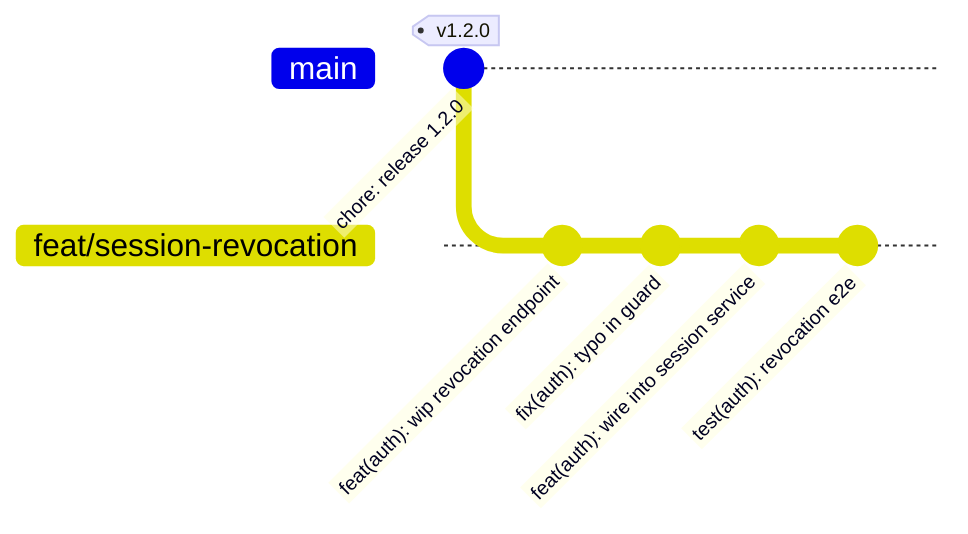
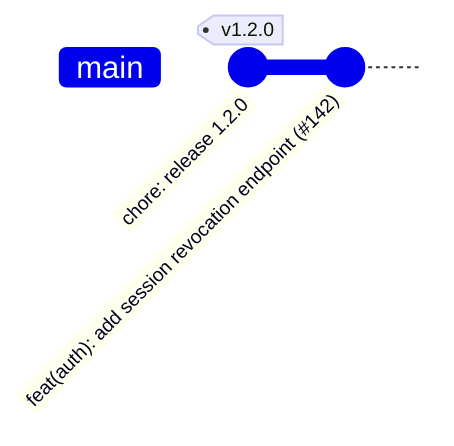
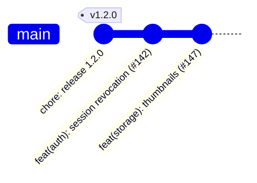
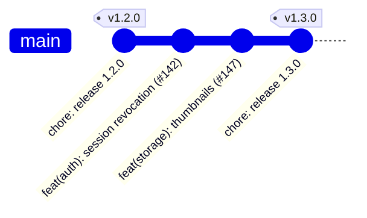
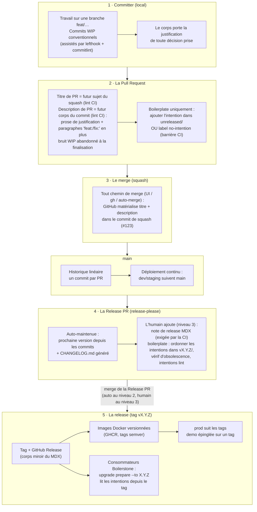

# Système de contribution et de release — décisions et plan

> Version française de [SPEC.md](./SPEC.md). En cas de divergence, la version anglaise fait foi ; toute modification doit être reportée dans les deux fichiers.

Statut : **design validé, pas encore construit**. Ce document consigne chaque décision, sa justification, et la façon dont les pièces s'assemblent. Il existe pour qu'on ne rediscute jamais un choix sans information nouvelle.

Le système s'applique au **dépôt du boilerplate** et aux **projets consommateurs** générés à partir de lui. Les différences entre les deux sont signalées tout au long du document et résumées dans [Boilerplate vs consommateur](#5-boilerplate-vs-consommateur).

---

## 0. L'histoire d'abord

Avant les règles, voici une semaine normale sur un projet qui utilise ce système. Deux développeurs, Pierrick et Nicolas. Le projet est en version `1.2.0` et fonctionne au niveau de release 3 (un humain décide quand publier — voir D11). Chaque règle sur laquelle l'histoire s'appuie est spécifiée dans les décisions plus bas.

### Lundi — Pierrick travaille

Pierrick développe la révocation de session sur une branche. Il committe au fil de l'eau, via son agent. Les commits sont des notes de travail honnêtes — l'un d'eux est littéralement une correction de faute de frappe. Chacun passe commitlint (lefthook vérifie le format en local), mais personne ne les peaufine. Ils n'atteindront jamais `main` en tant que commits.



### Mardi — Pierrick merge

Le titre de la PR est `feat(auth): add session revocation endpoint` — la CI a vérifié que c'est un en-tête conventionnel valide, car ce titre est sur le point de devenir permanent. Quand la PR est prête, Pierrick dit à son agent « finalise cette PR ». L'agent — en suivant le skill `finalize-pr`, sur la machine de Pierrick — lit le diff complet et rédige la **description de la PR** comme futur corps du commit : un court paragraphe sur le *pourquoi* la révocation utilise des vérifications de type tombstone plutôt que des suppressions de session. Rien d'autre — pas de captures d'écran, pas de checklist ; les échanges de review vivent dans les commentaires. Un check CI valide la description et passe au vert.

Ensuite, n'importe qui peut merger, depuis n'importe où. Le dépôt est configuré pour que le message du commit de squash soit *toujours* « titre de la PR + description de la PR » — le bouton de merge GitHub, `gh` et l'auto-merge produisent tous le même commit soigné. Il n'y a aucun message à composer au moment du merge, donc aucun moyen de le rater. Pierrick clique sur le bouton. La branche meurt.

Les quatre sujets WIP ne suivent **pas** — « wip endpoint » et « typo in guard » n'apprennent rien à un futur lecteur que le diff et la justification ne disent déjà. Seul le contenu qui mérite la permanence a été écrit dans la description, et seule la description atterrit dans l'historique.

`main` a maintenant **un** nouveau commit :



Quelques minutes plus tard, une PR de bot apparaît (ou se met à jour) : la **Release PR**, maintenue par release-please. Elle lit le nouveau commit, propose la version `1.3.0` (un `feat` signifie un bump mineur), et régénère `CHANGELOG.md` avec une ligne — « add session revocation endpoint », liée au commit `#142`. Personne ne la merge. Elle reste là, toujours à jour.

### Mercredi — Nicolas merge

Nicolas livre la génération de miniatures. Pendant ses tests, il a aussi corrigé un vrai bug de pagination — un second changement visible par les consommateurs, sans rapport, dans la même PR. C'est le choix de curation au cœur du système : sur ses cinq commits de travail, exactement **deux** méritent d'exister ensuite. À la finalisation, son agent écrit le titre de la PR pour le premier, met un paragraphe conventionnel pour le second dans la description, et abandonne le reste — les commits « wip » et « fmt » sont du bruit une fois l'historique détruit.

Le message du commit de squash ressemble à ceci (abrégé) :

```
feat(storage): add image thumbnail generation (#147)

Thumbnails are generated at upload time rather than on-the-fly because
the S3 bucket is not fronted by a CDN yet; …

fix(api): correct off-by-one in list endpoint pagination
```



La Release PR se met à jour à nouveau : toujours `1.3.0` (deux feats et un fix restent un mineur), mais le changelog affiche maintenant **trois** lignes — révocation, miniatures et le fix de pagination. Deux d'entre elles pointent vers le même commit `#147` ; c'est normal, le fix a été déclaré comme un changement à part entière.

Pendant ce temps, staging a été redéployé à chaque merge. La production n'a pas bougé — elle suit les tags de release, et il n'y a pas encore de nouveau tag.

### Vendredi — Pierrick publie

Le client a validé les fonctionnalités sur staging ; Pierrick décide de livrer. Il ouvre la Release PR — le bump de version et le changelog sont déjà là. Son travail restant est la partie humaine : il rédige la note de release (`releases/v1.3.0.mdx` dans l'app de documentation) — quelques phrases sur pourquoi cette release existe et ce qu'elle change pour les utilisateurs — et ajuste les formulations là où le texte généré est sec. Un check CI sur cette PR refuse le merge sans la note de release. Il merge.

Release-please pose le tag `v1.3.0`, crée la GitHub Release (son corps est un miroir du MDX), et le tag déclenche le build Docker : les images `1.3.0`, `1.3`, `latest` arrivent sur GHCR. La production, qui suit les tags, se déploie.



Total du contenu écrit à la main sur tout le cycle : deux corps de squash et une note de release. Tout le reste — numéro de version, changelog, tag, GitHub Release, images, déploiements — a été dérivé. Et chaque « pourquoi » est à un `git show` de distance, pour toujours.

*Sur le dépôt du boilerplate, la même histoire a un temps supplémentaire : la PR de Pierrick aurait porté un fichier d'intention de migration (ou un label `no-intention`), et la release du vendredi inclurait l'ordonnancement des intentions en attente dans le répertoire `v1.3.0` (D10).*

---

## 1. Objectifs

1. Un système de versionnement sémantique qui fonctionne : des numéros de version calculés à partir du travail lui-même, pas de mémoire ni de jugement au doigt mouillé.
2. Un changelog complet et lisible : une ligne par changement depuis la release précédente, entièrement généré, avec des liens vers les commits.
3. Des notes de release humaines : le « pourquoi » d'une release, écrit par une personne, stocké dans le dépôt.
4. La justification de chaque changement est capturée une seule fois, au moment où elle est la plus fraîche, et n'est jamais perdue.
5. Le tout s'intègre bien avec les pipelines d'images Docker et avec le système de mise à niveau Boilerstone (qui distribue les intentions de migration via les tags git).

## 2. Principes fondamentaux

Ces principes ont guidé chaque décision ci-dessous. En cas de doute, revenir ici.

### 2.1 Tout ce qui est durable vit dans le dépôt

La connaissance doit vivre dans des fichiers et dans l'historique git — pas dans les PR GitHub, les GitHub Releases, ni aucune autre surface de plateforme. Les fichiers et git sont trivialement accessibles pour les humains comme pour les agents ; les données de plateforme demandent de la plomberie d'API et meurent si on change de plateforme.

Les surfaces GitHub sont autorisées comme **lieux d'édition** et **miroirs**, jamais comme source de vérité. Une description de PR est un crayon ; le commit de squash est le papier.

### 2.2 Les commits sont la source de vérité

Le message du commit de squash (merge) est le seul artefact écrit à la main par PR. Tout le reste en dérive :

| Niveau de zoom | Artefact | Écrit par | Contient |
|---|---|---|---|
| Implémentation | Message du commit de squash | Agent guidé par un humain, à la finalisation de la PR | Ce qui a changé et **pourquoi** (justification dans le corps) |
| Inventaire | `CHANGELOG.md` | Généré (release-please) | Une ligne par changement, liens vers les commits |
| Release | Note de release dans l'app de docs | Humain (brouillon par agent) | Pourquoi cette release existe, ce que l'ensemble signifie |

La justification est écrite **une seule fois**, dans le corps du commit. Le changelog ne la duplique pas — il pointe vers le commit, et `git show` est à un saut de distance. La duplication crée une seconde copie qui dérive.

### 2.3 Les environnements consomment des artefacts, ils ne possèdent jamais de commits

Aucun environnement n'a « sa » branche sur laquelle committer. `main` produit des artefacts (builds, images, tags) ; chaque environnement pointe vers un flux d'artefacts. Les branches de déploiement, si un hébergeur en exige une, sont des pointeurs avancés en fast-forward — jamais des espaces de travail.

---

## 3. Décisions

Chaque décision ci-dessous indique **ce que** nous avons choisi, **pourquoi**, et ce que nous avons explicitement rejeté.

### D1. Conventional Commits, types standards uniquement

Nous suivons la spécification [Conventional Commits 1.0.0](https://www.conventionalcommits.org/fr/v1.0.0/) : `<type>(<scope>): <description>`, corps, footers.

- **Types** : uniquement l'ensemble standard (`feat`, `fix`, `docs`, `style`, `refactor`, `perf`, `test`, `build`, `ci`, `chore`, `revert`). Pas de types personnalisés pour l'instant.
  - *Pourquoi* : moins de règles à enseigner ; et la regex de découpage du corps de release-please ne reconnaît que la liste standard, donc des types personnalisés ne compteraient silencieusement pas comme changements supplémentaires dans une PR multi-changements (vérifié dans le source de release-please, `src/commit.ts`).
  - *À revoir si* : les sections du changelog généré semblent inadaptées et qu'on veut des types comme `remove:` ou `security:` correspondant aux rubriques de style Keep-a-Changelog.
- **Scopes = domaines suivis**. La liste des scopes de commit est la même que celle des domaines suivis par Boilerstone (`tooling`, `api`, `frontend`, `auth`, `email`, `storage`, `monitoring`, `ai`, `docker-env`, `ci`), plus `boilerstone` pour le système de mise à niveau lui-même.
  - *Pourquoi* : un commit comme `feat(auth): …` indique déjà au mainteneur de release à quel domaine appartient une intention de migration, et correspond au filtre par domaine de `upgrade path`.
- **Calcul de version** : `fix` → patch, `feat` → mineur, `!` ou footer `BREAKING CHANGE:` → majeur.

### D2. `commitlint.config.ts` est la source de vérité unique pour les types et les scopes

Les types et scopes valides vivent dans un seul tableau exporté dans `commitlint.config.ts`. `CONTRIBUTING.md`, le runbook de release et les docs **pointent vers lui** et ne recopient jamais la liste.

- *Pourquoi* : deux copies dérivent. Le runbook recopie actuellement la liste des domaines en prose — cela s'arrête.
- **Personnalisation consommateur** : un projet consommateur édite le tableau de scopes (ajouter `billing`, retirer `ai`) sans toucher au moindre document de règles. En termes Boilerstone, la config est un fichier `adapt` ; `CONTRIBUTING.md` reste stable côté boilerplate.
- Amélioration future possible : `intentions lint` vérifie que le domaine de chaque intention existe dans la config.

### D3. Les corps de commit portent la justification

Le sujet du commit décrit le changement. Le **corps** du commit explique la décision : pourquoi cette approche, ce qui a été rejeté, quelle contrainte l'a motivée. Un corps est **attendu** pour tout commit qui prend une décision.

- *Pourquoi* : c'est la couche où « pourquoi a-t-on fait ça ? » trouve sa réponse un an plus tard, ce qui évite d'annuler par ignorance des changements bien raisonnés. Historiquement cette connaissance vivait dans les fils de discussion des PR (liée à la plateforme, difficile d'accès). Les agents écrivent de bons corps à bas coût ; l'excuse a disparu.
- **Règle dure** : ne jamais écrire le token `BREAKING-CHANGE:` dans un corps sauf pour forcer volontairement une release majeure. Release-please le détecte n'importe où dans le texte du corps (vérifié dans le source).

### D4. lefthook pour les hooks git locaux

`lefthook` exécute commitlint sur `commit-msg`.

- *Pourquoi lefthook plutôt que husky* : binaire unique, rapide, un seul `lefthook.yml`, hooks parallèles, pas de couplage au script `prepare`. Fonctionnellement équivalent pour notre besoin ; question de goût.
- L'application locale est une couche de courtoisie / feedback rapide. Les commits WIP disparaissent au squash ; l'historique mergé est protégé par les checks CI sur la PR (D6).

### D5. Squash merge, un seul `main`, pas de `develop`

- **Squash merge uniquement.** Les commits de merge et le rebase-merge sont désactivés dans les réglages du dépôt.
  - *Pourquoi* : historique linéaire (release-please le recommande fortement) ; un commit par PR rend les cherry-picks triviaux ; le cas multi-changements est couvert par des paragraphes conventionnels supplémentaires dans le corps du squash (D6). Nous acceptons de perdre la granularité de bisect par commit WIP — les PR doivent rester petites.
- **Une seule branche `main`. Les releases sont des tags, pas des branches.**
  - *Pourquoi pas de `develop`* : la « ligne stable » existe déjà — c'est la liste des tags. Les consommateurs n'installent jamais depuis `main` (`install.sh` rejette les branches par conception). Une branche `develop` dupliquerait ce que les tags fournissent, et release-please suppose un tronc unique. Git-flow résolvait des trains de release parallèles que nous n'avons pas à 3–4 développeurs.
- **Nommage des branches** (`feat/…`, `fix/…`) : convention documentée, appliquée avec souplesse. Avec le squash merge, il ne porte aucune information de release.

### D6. Des commits WIP brouillons au commit de squash

C'est la transition la plus importante du système : une branche pleine de commits de travail devient **un commit soigné** sur `main`. Rien n'est promu depuis le WIP automatiquement — la promotion est un acte éditorial délibéré à la finalisation de la PR.

#### Les deux historiques et leurs niveaux d'exigence

- **Les commits WIP** (sur la branche) sont les notes de travail de l'auteur. La seule exigence est le format commitlint (appliqué par lefthook) pour qu'ils restent lisibles ; au-delà, les « wip », demi-étapes et corrections de correction sont tous acceptables. Ils ne sont jamais rejoués individuellement sur `main` — le squash les efface en tant que commits, et leurs *messages* meurent avec eux, sauf si leur contenu est délibérément promu.
- **Le commit de squash** (sur `main`) est l'enregistrement permanent et l'entrée du versionnement. Il est *écrit*, pas assemblé — et il ne contient **que ce qui mérite la permanence** : le sujet, la prose de justification, et un paragraphe conventionnel par changement supplémentaire visible par les consommateurs. Les sujets WIP comme « wip endpoint » ou « fmt » sont du bruit une fois l'historique détruit ; ils ne suivent pas. Si un commit WIP a capturé quelque chose qui vaut d'être gardé (une décision, un piège), son *contenu* est promu dans la justification — jamais sa ligne de sujet telle quelle.

#### Ce que le parseur lit (vérifié dans `src/commit.ts` de release-please)

- La **ligne de sujet** est parsée comme un commit conventionnel → une entrée de changelog, compte dans le calcul de version.
- Tout **paragraphe du corps qui commence une nouvelle ligne, sans puce, après une ligne vide, par un type standard** (`feat: …`, `fix(scope): …`) est parsé comme un commit *supplémentaire* → sa propre entrée de changelog, compte dans le calcul de version.
- **Les lignes à puces (`* fix: typo`) ne matchent jamais.** Utile comme fait de sécurité : si la liste WIP auto-générée par GitHub se glisse un jour dans un merge, elle est invisible pour le parseur — un problème d'hygiène, pas un incident de versionnement.
- Le token `BREAKING-CHANGE:` matche **n'importe où** dans le corps, même au milieu d'une phrase → force un majeur. D'où l'avertissement toujours actif (6.3).

#### Le mécanisme : la description de la PR *est* le futur corps du commit

Le design naïf — composer le message au moment du merge — échoue en pratique : la plupart des développeurs mergent depuis l'interface GitHub, et un message composé dans une zone de texte au moment du clic n'est ni relu ni fiable. La finalisation est donc entièrement déplacée **hors du clic de merge** :

- Le réglage de squash du dépôt est **« Default to pull request title and description »** (D13). Qui que ce soit qui merge — bouton de l'UI, `gh pr merge --squash`, auto-merge — GitHub matérialise le titre de la PR comme sujet du commit et la description de la PR, mot pour mot, comme corps du commit. Il n'y a rien à composer au moment du merge.
- La **description de la PR est donc le brouillon de l'enregistrement permanent**, et elle est tenue aux standards d'un corps de commit : prose de justification plus un paragraphe conventionnel par changement supplémentaire, rien d'autre. Captures d'écran, checklists et échanges de review vont dans les commentaires de la PR, jamais dans la description.
- Un **lint de description** en CI (D7) bloque le merge tant que la description n'est pas propre : non vide, paragraphes conventionnels supplémentaires valides selon `commitlint.config.ts`, aucun token `BREAKING-CHANGE:` involontaire.
- Cela rend le futur historique **relisible** : les reviewers voient dans la PR exactement ce qui atterrira dans `git log`, et peuvent demander des changements sur la formulation de la justification comme sur du code. C'est aussi pourquoi aucun bot de merge n'est nécessaire — la justesse vient du réglage du dépôt plus la barrière, pas de qui clique.

La finalisation elle-même s'exécute sur la machine de l'auteur : l'auteur dit à son agent « finalise cette PR », et l'agent (suivant le skill `finalize-pr`) met à jour le titre et la description via `gh pr edit`. La CI ne fait que vérifier ; rien ne compose de messages côté serveur.

#### La transformation, étape par étape

1. **Pendant la PR** : le titre est maintenu exact — c'est le futur sujet (la CI le linte comme en-tête conventionnel, D7). La description peut rester une ébauche jusqu'à la finalisation.
2. **À la finalisation** : l'agent lit le diff complet — pas les sujets WIP, qui sous-décrivent le résultat — et décide des *changements visibles par les consommateurs* que cette PR apporte. Un changement principal = le titre. Chaque changement supplémentaire = un paragraphe conventionnel sans puce dans la description. Tout le reste de l'historique WIP est abandonné.
3. **Écrire la justification** en prose dans la description (D3) : pourquoi cette approche, ce qui a été rejeté. Distiller ce que les corps des commits WIP ont capturé en chemin — promotion par jugement, pas par concaténation.
4. **Merger depuis n'importe où** : une fois la review et le lint de description au vert, le bouton de l'UI est aussi sûr que la CLI. GitHub ajoute `(#142)` au sujet : le lien durable code↔PR.

#### Exemple travaillé

Historique de la branche (notes de travail, toutes valides pour commitlint) :

```
feat(auth): wip revocation endpoint
fix(auth): typo in guard
feat(auth): wire revocation into session service
fix(api): off-by-one in list pagination, found while testing
test(auth): revocation e2e
chore(auth): fmt
```

Titre de la PR : `feat(auth): add session revocation endpoint`. Tout ce qui suit la ligne de sujet est la description de la PR, écrite à la finalisation ; GitHub matérialise les deux dans le commit de squash au merge :

```
feat(auth): add session revocation endpoint (#142)

Sessions could only expire naturally; support needed a way to kill a
compromised session immediately. Revocation is a tombstone check on
each request rather than a session-store delete, because Better Auth
caches sessions client-side and a delete alone would not invalidate
already-issued tokens. Rejected: shortening session TTL globally
(punishes every user for the rare compromise case).

fix(api): correct off-by-one in list endpoint pagination
```

Six commits de travail sont devenus un sujet, une justification et un paragraphe conventionnel supplémentaire. Les sujets « wip », « typo », « test » et « fmt » ont été abandonnés — ils décrivent le *trajet*, et le trajet est terminé ; le diff et la justification décrivent le *résultat*. Le fix de pagination a survécu parce que c'est un vrai changement visible par les consommateurs, qui mérite son propre impact de version et sa ligne de changelog.

Ce que release-please voit : **deux** changements — `feat(auth)` (sujet) et `fix(api)` (paragraphe sans puce) → bump mineur, deux lignes de changelog pointant vers ce commit. La prose de justification est ignorée par le parseur mais permanente dans git : `git show` répond à « pourquoi des tombstones ? » pour toujours.

Ce qui se passerait mal sans la passe éditoriale : le fix de pagination serait invisible pour le changelog et la version, et la décision « pourquoi des tombstones » n'existerait que dans un fil de PR.

#### Issue de secours

Release-please honore un bloc `BEGIN_COMMIT_OVERRIDE … END_COMMIT_OVERRIDE` dans la description de la PR, qui remplace le message du commit à des fins de parsing — et il lit la description au moment du parsing, donc cela fonctionne même **après** le merge. C'est l'outil de correction pour un message mergé raté : éditer la description de la PR, ajouter le bloc d'override, et la Release PR recalcule — aucune chirurgie git. Pas un outil du flux normal (il sépare l'enregistrement git de l'enregistrement parsé) ; en flux normal, corriger la description *avant* de merger.

### D7. Barrières CI sur chaque PR

- **Lint du titre de PR** : le titre doit être un en-tête de commit conventionnel valide avec un scope valide (p. ex. `amannn/action-semantic-pull-request`, alimenté par `commitlint.config.ts`).
  - *Pourquoi le titre* : il devient le sujet du squash, qui est ce que release-please lit. Linter les commits WIP est optionnel ; linter le titre est obligatoire.
- **Lint de la description de PR** : la description doit être propre comme un corps de commit (D6) : non vide au moment du merge, tout paragraphe conventionnel supplémentaire valide selon `commitlint.config.ts`, aucun token `BREAKING-CHANGE:` involontaire, aucun contenu manifestement hors commit (images, listes de tâches).
  - *Pourquoi* : la description est matérialisée mot pour mot dans le corps du commit de squash — cette barrière est ce qui rend le bouton de merge de l'UI sûr.
- **Vérification des mots WIP**, appliquée au titre et aux paragraphes conventionnels de la description — les chaînes qui deviendront des entrées de changelog. Rejette les traces révélatrices d'une finalisation inachevée : `wip`, `fixup`, `squash`, `tmp`, `temp`, `oops`, `typo`, `fmt`, `lint`, `do not merge`, `wtf`, suffixes `…2`/`again`. Correspondance sur mots entiers, sur le texte des entrées uniquement (la prose de justification est exemptée — « fixed a typo in the guard » y est acceptable) ; la liste vit à côté de `commitlint.config.ts` pour que les équipes puissent l'ajuster.
  - *Pourquoi* : ce sont les mots qui glissent d'un sujet WIP vers une ligne de changelog permanente quand quelqu'un merge sans finaliser. Bon marché à attraper, embarrassant à livrer.
- **Barrière d'intention** (dépôt du boilerplate uniquement) : la PR doit soit ajouter un fichier sous `.boilerstone/migration-intentions/unreleased/`, soit porter le label `no-intention`.
  - *Pourquoi un label* : c'est une barrière, pas de la connaissance — rien de durable n'est perdu si on quitte GitHub. Même schéma que le label actuel `no-changelog`.
- La barrière existante `changelog check` est **supprimée** — le changelog est désormais généré (D8).

### D8. release-please possède le versionnement, le tagging et le changelog

[release-please](https://github.com/googleapis/release-please) tourne comme GitHub Action :

- Il surveille `main`, calcule la prochaine version à partir des commits conventionnels depuis le dernier tag, et maintient une **Release PR** ouverte contenant le bump de version et le `CHANGELOG.md` régénéré.
- Merger la Release PR crée le tag `vX.Y.Z` et la GitHub Release.
- **Le changelog est entièrement généré.** Une ligne par changement (par message conventionnel parsé), groupé par type via la config `changelog-sections`, chaque ligne pointant vers son commit. Aucune entrée écrite à la main, aucune duplication de justification (D3, principe 2.2).
  - *Pourquoi nous avons changé d'avis* : l'ancienne règle « ne jamais générer le changelog » précède les commits écrits par agents. Avec des messages de squash soignés, le changelog généré *est* l'inventaire soigné. Les deux raisons qui justifiaient la curation manuelle (granularité des entrées, justifications) sont désormais traitées au moment de l'écriture du commit (granularité = les paragraphes que l'auteur écrit ; justifications = corps du commit, à un lien de distance).
- **Porteur de version** : le `package.json` racine uniquement, une seule release pour tout le monorepo. Les manifestes des apps ne sont pas touchés. `extra-files` peut synchroniser d'autres fichiers plus tard si quelque chose a besoin de la version (un endpoint `/version`, un label Docker).
- **La config vit dans le dépôt** (`release-please-config.json`, `.release-please-manifest.json`) — cohérent avec le principe 2.1.
- **À valider dans un dépôt jetable avant de construire le reste** (le seul risque ouvert) : le mapping `changelog-sections`, la qualité du changelog produit, et le comportement de la Release PR avec nos conventions de squash.

### D9. Les notes de release vivent dans l'app de documentation ; la GitHub Release est un miroir

- Les notes de release sont des pages MDX : `apps/documentation/src/content/docs/releases/vX.Y.Z.mdx`.
  - *Pourquoi* : les notes de release portent une intention et un ton humain — le « pourquoi de la release » (p. ex. « ces cinq PR livrent ensemble X »). Une partie de ce contexte vit hors du dépôt, donc un humain doit l'écrire (brouillon par agent à partir du changelog et des corps de commits, finition humaine). Et selon le principe 2.1 elles doivent vivre dans le dépôt — bonus : l'app de docs publie sur GitHub Pages, donc elles deviennent gratuitement de la communication produit publique.
- **Écrites sur la Release PR** : le mainteneur committe la note de release sur la PR de release-please avant de merger. Un check CI sur la Release PR refuse le merge sans `releases/vX.Y.Z.mdx`.
- **Au moment du tag**, une étape du workflow copie le contenu MDX dans le corps de la GitHub Release. GitHub reste utile (notifications, navigation) ; le dépôt reste l'autorité.
- Notes de release ≠ changelog : le changelog est l'inventaire complet généré ; la note est l'histoire humaine. La note explique le *pourquoi de la release* ; les pourquoi d'implémentation restent dans les corps de commits.

### D10. Les intentions de migration sont écrites par PR (dépôt du boilerplate uniquement)

- Une PR qui modifie le boilerplate d'une façon à laquelle les consommateurs doivent s'adapter **inclut son intention de migration** dans la même PR : `.boilerstone/migration-intentions/unreleased/slug.md`. Pas encore de préfixe d'ordre `NN-`.
  - *Pourquoi* : l'auteur de la PR a le contexte et peut guider un agent pour l'écrire ; le mainteneur de release ne peut pas reconstruire le « pourquoi » de cinq PR au moment de la release. Le mainteneur devient un plombier, pas un auteur.
  - Le lien code↔intention est la PR elle-même : le même commit de squash contient les deux. `git log` sur le fichier d'intention le retrouve. Champ frontmatter `pr:` optionnel pour être explicite.
- Toutes les PR ne produisent pas d'intention (refactorings, CI interne au boilerplate) : ces PR prennent le label `no-intention` (D7) et n'apparaissent que dans le changelog généré.
- **Au moment de la release**, le mainteneur, sur la Release PR :
  1. déplace `unreleased/*.md` vers `migration-intentions/vX.Y.Z/`, assigne l'ordre d'exécution `NN-`, câble `requires:` entre intentions issues de PR différentes ;
  2. vérifie l'obsolescence : compare `git diff vPREVIOUS..HEAD` aux intentions en attente (une PR ultérieure a pu modifier des fichiers référencés par une intention antérieure) ;
  3. exécute la validation existante (`intentions sync`, `intentions lint`, `upgrade path`).
- Les intentions gardent leur format existant et leur distribution par tags. **Pas de releases par hash** : les tags restent le seul ancrage public ; le répertoire de staging `unreleased/` capture l'intention au moment de la PR sans casser l'ordre semver ni `upgrade prepare`.
- L'inventaire au moment de la release est désormais `git log vPREVIOUS..HEAD` + les intentions en attente (le changelog jouait ce rôle ; le changelog généré le remplit tout aussi bien).

### D11. Trois niveaux de CD, déploiement décorrélé de la release

Le déploiement et la release sont des déclencheurs indépendants sur le même pipeline :

- Chaque merge sur `main` → build/déploiement de l'artefact « dernier main » (image taguée par SHA, ou Dokploy builde depuis la branche).
- Chaque tag de release → images Docker versionnées via les règles semver de `docker/metadata-action` (`1.2.3`, `1.2`, `latest`).

Les trois niveaux sont de la configuration, pas des pipelines différents :

| Niveau | Versionnement | Déclencheur de release | Stade typique |
|---|---|---|---|
| **1** | commitlint seul, pas de versions | aucun (pas de release-please) | projet jeune ; souvent seul staging existe ; Dokploy surveille `main` et builde |
| **2** | semver complet | **automatique** : la Release PR de release-please s'auto-merge quand les checks passent | le projet veut des numéros de version et des images versionnées, tout en livrant en continu |
| **3** | semver complet | **manuel** : un humain merge la Release PR | barrière de production ; merger sur `main` ne bouge que staging |

- Le niveau 2 est le niveau 3 plus un drapeau d'auto-merge — passer de l'un à l'autre revient à ajouter/retirer un drapeau, pas à adopter un outil.
- **Correspondance des environnements** (couvre l'éventail habituel dev/staging/demo/prod) :
  - `dev.monsite.com`, `staging.monsite.com` → suivent `main` (chaque merge).
  - `demo.monsite.com` → épinglé sur un tag de version choisi, déplacé à la demande. Aucune branche nécessaire.
  - `monsite.com` → suit les tags de release.
  - Si un PaaS a besoin d'une branche à surveiller, `deploy/<env>` existe comme **pointeur avancé en fast-forward** vers le tag — jamais de commit direct dessus (principe 2.3).
- **Modes Dokploy** : niveau 1 = Dokploy surveille la branche et builde. Niveaux 2–3 = GitHub builde les images GHCR (le `push-to-ghcr.yml` existant, déclenché sur les tags `v*`), Dokploy les tire. Le moment où un projet a besoin d'environnements sur des versions *différentes* est le moment où il doit passer aux images.
- **Défauts** : les nouveaux projets consommateurs démarrent au niveau 1. Le dépôt du boilerplate lui-même tourne au niveau 3 (sa Release PR est l'endroit où les intentions sont ordonnées et la note de release écrite).

### D12. Livraison sélective : feature flags d'abord, cherry-pick sur branche de release en secours

Le problème du client-veut-B-sans-A (les deux mergés, A ne doit pas partir) :

1. **Préféré : les feature flags**, comme convention légère — une vérification de variable d'environnement (`FEATURE_X=true`) lue à un seul endroit. Un helper, une page de doc ; pas une plateforme de flags. A merge mais reste éteint.
2. **Secours : branche de release.** Brancher depuis le dernier tag de release, cherry-picker le commit de squash de B (trivial — un commit par PR), publier une release de patch depuis cette branche. Release-please sait publier depuis une branche autre que `main`. La prochaine release normale de `main` inclut A et B, et la branche meurt.
3. Retarder le merge est acceptable occasionnellement, mauvais comme habitude.

La barrière de release du niveau 3 supprime la plupart des *autres* cherry-picks : merger ne signifie plus déployer en production, donc les ensembles inachevés peuvent merger librement.

### D13. Réglages du dépôt GitHub (la partie qui ne peut pas vivre dans le code)

Une checklist de configuration documentée, éventuellement scriptée une fois avec `gh api` pour que configurer un nouveau dépôt consommateur tienne en une commande :

- Squash merge uniquement (désactiver les commits de merge et le rebase merge).
- Message de squash par défaut : **« pull request title and description »** — le réglage porteur (D6) : il fait que chaque chemin de merge (UI, CLI, auto-merge) matérialise le titre + la description soignés dans le commit, sans rien à composer au moment du clic.
- Labels : `no-intention` (boilerplate), plus les labels de release-please.
- Protection de branche sur `main` : checks requis (CI, lint du titre de PR, barrière d'intention le cas échéant).

---

## 4. Le flux



Résumé étape par étape :

1. **Committer** : commits WIP conventionnels avec justification dans les corps. Outils : commitlint + lefthook en local ; un skill d'agent pour écrire les messages de commit (conventions de sujet, règles de corps, le piège `BREAKING-CHANGE:`).
2. **Créer sa PR** : le titre est le futur sujet du squash — l'écrire comme l'en-tête conventionnel qu'il deviendra. Garder les PR petites et mono-sujet. La description est tenue aux standards d'un corps de commit (captures d'écran et checklists vont en commentaires). Dépôt du boilerplate : inclure l'intention de migration ou le label `no-intention`. À ne pas faire : empaqueter des changements sans rapport, écrire un titre vague en prévoyant de « corriger au merge ».
3. **Finalisation, puis merge** : le moment éditorial (D6) a lieu *avant* le merge, sur la machine de l'auteur — l'agent lit le diff, décide des changements visibles par les consommateurs (titre + un paragraphe conventionnel sans puce chacun), distille les corps WIP en prose de justification dans la description de la PR, abandonne le reste. Une fois le lint de description au vert, tout chemin de merge (UI, `gh`, auto-merge) produit le même commit soigné.
4. **La Release PR** : release-please la maintient à jour (version + changelog). Au niveau 3, les humains s'en servent comme espace de travail de release : note de release, ordonnancement des intentions, validations. Au niveau 2, elle s'auto-merge.
5. **La release** : tag, GitHub Release miroir, images versionnées, les environnements qui suivent les tags bougent. Pour le boilerplate, le tag est aussi ce sur quoi les consommateurs Boilerstone se mettent à niveau.

---

## 5. Boilerplate vs consommateur

| Élément | Dépôt boilerplate | Projet consommateur |
|---|---|---|
| Conventional commits, commitlint, lefthook | ✔ | ✔ (édite le tableau de scopes) |
| Lint du titre + de la description de PR | ✔ | ✔ |
| Barrière d'intention (`unreleased/` ou `no-intention`) | ✔ | ✘ (pas de machinerie d'intentions — retirée à la génération) |
| release-please | ✔, niveau 3 | Optionnel : niveau 1 (off), 2 (auto) ou 3 (manuel) |
| `CHANGELOG.md` généré | ✔ | ✔ aux niveaux 2–3 |
| Notes de release dans l'app de docs | ✔ (`apps/documentation/…/releases/`) | ✔ au niveau 3 (leur propre histoire produit) ; optionnel au niveau 2 |
| Plomberie des intentions sur la Release PR | ✔ | ✘ |
| Images GHCR déclenchées par tag | ✔ (dogfooding) | Recommandé aux niveaux 2–3 |
| `CONTRIBUTING.md` | ✔ | ✔ livré ; personnalisation des scopes/domaines via la config, pas la prose |
| Checklist / script des réglages GitHub | ✔ | ✔ (à exécuter une fois à la création du projet) |

L'ensemble de la fonctionnalité est livré aux consommateurs comme une release normale du boilerplate avec une intention de domaine `ci` — le système se dogfoode lui-même.

---

## 6. Outillage des agents — barrières, documents, règles, skills

L'équipe committe principalement via des agents, donc le système doit rendre les agents corrects **par construction**, pas en espérant qu'ils lisent la doc. Quatre couches, classées par fiabilité :

### 6.1 Barrières : les machines attrapent ce que personne n'a lu

Un agent qui n'a rien lu doit quand même être arrêté par l'outillage, et chaque message de rejet doit énoncer la correction — **les messages d'erreur sont des prompts**. La barrière de changelog actuelle le fait déjà bien (« Add your entry under `## [Unreleased]`, or label the PR `no-changelog` ») ; chaque nouvelle barrière suit le même style.

| Barrière | Où | Le message doit dire |
|---|---|---|
| commitlint via lefthook | `commit-msg` local | quelle règle a échoué ; les types/scopes valides vivent dans `commitlint.config.ts` |
| Lint du titre de PR | CI sur chaque PR | « le titre devient le sujet du squash — l'écrire comme `type(scope): description` ; scopes valides : … » |
| Lint de la description de PR | CI sur chaque PR | « la description devient le corps du commit mot pour mot — prose de justification + paragraphes conventionnels valides uniquement ; déplacer captures/checklists en commentaires » |
| Vérification des mots WIP | CI sur chaque PR (titre + paragraphes conventionnels) | « 'wip' atterrirait dans le changelog — finalisez la PR : réécrivez le titre/paragraphe pour décrire le résultat » |
| Barrière d'intention (boilerplate) | CI sur chaque PR | « ajoutez une intention sous `.boilerstone/migration-intentions/unreleased/` ou appliquez le label `no-intention` » |
| Vérification de note de release | CI sur la Release PR | « ajoutez `apps/documentation/src/content/docs/releases/vX.Y.Z.mdx` avant de merger » |
| `intentions lint` / `sync` | CI sur la Release PR (boilerplate) | messages existants |

Un piège qu'aucun linter ne peut attraper : un token `BREAKING-CHANGE:` égaré dans un corps de commit est une syntaxe *valide* qui force silencieusement une release majeure. C'est pourquoi il figure dans la règle toujours active (6.3), pas seulement dans `CONTRIBUTING.md`.

### 6.2 Documents canoniques : un canon par étape, jamais recopié

Même règle anti-dérive que D2 — les skills et les règles **pointent** vers ces documents et ne dupliquent jamais leur contenu :

| Étape | Document canonique |
|---|---|
| Commits, PR, squash merge | `CONTRIBUTING.md` (racine, livré aux consommateurs) |
| Release du boilerplate | `.boilerstone/docs/release-maintainer-runbook.md` (réécrit) |
| Release consommateur, niveaux de CD | `apps/documentation/src/content/docs/references/1_release_and_versionning.mdx` |
| Écriture d'intention | `.boilerstone/migration-intentions/TEMPLATE.md` + sa section du runbook |
| Justification du design | la nouvelle page d'explication (issue des sections 2–3 de cette spec) |

### 6.3 Règles toujours actives : un pointeur, un avertissement

`AGENTS.md`, `CLAUDE.md` et `.cursor/rules/0_common.mdc` gagnent deux lignes, pas plus (le contexte toujours actif est un budget) :

1. « Avant de committer ou d'ouvrir une PR, lire `CONTRIBUTING.md` et le suivre. »
2. « Ne jamais écrire le token `BREAKING-CHANGE:` dans un message de commit sauf pour forcer volontairement une release majeure. »

Tout le reste est soit imposé par une barrière (6.1), soit documenté dans le canon (6.2). Délibérément **aucun résumé toujours actif des règles de commit** : commitlint donne un feedback correctif immédiat, qui enseigne plus vite que la prose.

### 6.4 Skills : adaptateurs légers pour les cérémonies

Committés dans `.claude/skills/` et `.cursor/skills/`, en suivant le schéma existant des adaptateurs boilerstone (description de déclenchement en frontmatter, « le canon vit à X — le lire d'abord », préambule, carte rapide, barrières non négociables). Les skills existent pour les *cérémonies* — procédures occasionnelles à plusieurs étapes. Les actions routinières reçoivent des règles et des barrières à la place.

| Skill | Dépôts | Déclencheur | Rôle |
|---|---|---|---|
| `finalize-pr` (nouveau) | boilerplate + consommateurs | « finalise / merge cette PR », « prépare le merge » | Exécuter la transformation D6 : lire le **diff complet** (pas les sujets WIP) pour identifier les changements visibles par les consommateurs ; poser le titre de la PR (en-tête conventionnel valide, scope valide) et écrire la description de la PR comme futur corps du commit — prose de justification distillée depuis les corps des commits WIP, un paragraphe conventionnel **sans puce** par changement supplémentaire, tout le reste de l'historique WIP abandonné ; scanner les `BREAKING-CHANGE:` accidentels. Applique le tout via `gh pr edit`. Boilerplate : vérifier intention-ou-label. Merger ensuite est sûr depuis n'importe quel chemin (UI, `gh`, auto-merge). |
| `boilerstone-intention` (nouveau) | boilerplate uniquement | « écris l'intention de migration (pour cette PR) » | Écrire une intention bornée à partir de `TEMPLATE.md` dans `unreleased/` **au sein de la PR courante**, sans préfixe `NN-`. Pointe vers la section d'écriture d'intention du runbook. |
| `boilerstone-release` (réécrit) | boilerplate uniquement | « prépare la release », « travaille la Release PR » | Opérer sur la Release PR de release-please : déplacer `unreleased/*.md` vers `vX.Y.Z/` avec l'ordre `NN-` et `requires:` ; vérifier l'obsolescence des intentions contre `git diff vPREVIOUS..HEAD` ; rédiger le brouillon de note de release MDX depuis le changelog + les corps de commits ; exécuter les validations. **Ne pose jamais de tag, ne merge jamais la Release PR** — c'est l'acte final de l'humain. |
| `project-release` (nouveau) | consommateurs, niveaux 2–3 | « prépare la release » | Variante consommateur du précédent, sans les intentions : rédiger la note de release, vérifier les checks de la Release PR. |
| `boilerstone-init`, `boilerstone-upgrade` | inchangés | — | — |

Délibérément **pas de skill `commit`** : on committe des dizaines de fois par jour, et les skills se déclenchent de façon peu fiable à cette fréquence. Le pointeur toujours actif (6.3), `CONTRIBUTING.md` et les erreurs correctives de commitlint couvrent le besoin.

### 6.5 Politique du dépôt

La section « bonnes pratiques IA » du README (« ne pas ajouter de règles au dépôt ») étend son exception des adaptateurs committés aux skills ci-dessus. Même contrainte que pour les adaptateurs boilerstone : légers, pointant vers le canon, mis à jour dans la même PR dès que les commandes ou règles du canon changent (le runbook impose déjà cette discipline pour les changements de CLI — même discipline ici).

---

## 7. Ce qui change dans le dépôt actuel

**Supprimé**
- Les commandes CLI `changelog check` et `changelog release` (`.boilerstone/cli/boilerplate.ts`) et le workflow `Changelog 📜` (`.github/workflows/changelog.yml`). Remplacés par le changelog généré + le lint de titre de PR + la barrière d'intention.
- La discipline du `CHANGELOG.md` maintenu à la main (le fichier devient généré ; les sections déjà publiées sont conservées comme historique).

**Ajouté**
- `CONTRIBUTING.md`, `commitlint.config.ts`, `lefthook.yml`.
- Workflows : lint de titre de PR, barrière d'intention, release-please, vérification de note de release sur la Release PR, étape miroir vers la GitHub Release.
- La collection `apps/documentation/src/content/docs/releases/`.
- Le répertoire de staging `.boilerstone/migration-intentions/unreleased/`.
- Skills : `finalize-pr`, `boilerstone-intention`, `project-release` (dans `.claude/skills/` et `.cursor/skills/`, cf. section 6.4).
- Deux lignes toujours actives dans `AGENTS.md`, `CLAUDE.md`, `.cursor/rules/0_common.mdc` (cf. section 6.3).
- Checklist des réglages GitHub (+ script `gh` optionnel).
- Convention de feature flags (helper + page de doc).

**Réécrit**
- `.boilerstone/docs/release-maintainer-runbook.md` — beaucoup plus court. La Release PR fait la plomberie (version, changelog, tag). Étapes humaines restantes : ordonner et vérifier l'obsolescence des intentions, écrire la note de release, smoke test. La section « discipline du changelog » et celle du choix de version disparaissent (automatisées) ; l'issue de secours par branche de release (D12) gagne une page. Gagne une section d'écriture d'intention (le canon vers lequel pointe `boilerstone-intention`).
- `.claude/skills/boilerstone-release/` et son jumeau `.cursor` — repointés vers le nouveau flux du runbook (section 6.4).
- La section « bonnes pratiques IA » du README — exception des adaptateurs étendue aux nouveaux skills (section 6.5).
- `apps/documentation/src/content/docs/references/1_release_and_versionning.mdx` (actuellement une ébauche TODO) — les trois niveaux, le semver, le flux de release, la correspondance des environnements, les patterns Dokploy.
- Une nouvelle page d'explication à côté de `0_designphilosophy.mdx` — la justification durable (sections 2 et 3 de ce document, orientées consommateurs).
- `push-to-ghcr.yml` — déclenché sur les tags `v*` avec tagging semver des images.

---

## 8. Plan d'implémentation

Ordonné pour que chaque tranche fonctionne sans celles qui suivent. Chaque tranche livre sa propre surface agent (messages de barrières, skill, lignes de règles) dans la même PR — jamais plus tard.

1. **Socle de contribution** : `CONTRIBUTING.md`, `commitlint.config.ts` (types + scopes), `lefthook.yml`, workflow de lint titre + description de PR incluant la vérification des mots WIP, checklist des réglages GitHub. Surface agent : les deux lignes de règles toujours actives (6.3) et le skill `finalize-pr` (6.4). Aucun changement de comportement de release pour l'instant.
2. **Prototype release-please** dans un dépôt jetable : valider le mapping `changelog-sections`, la qualité du changelog avec nos conventions de squash, le comportement de la Release PR, la création du tag. *C'est le seul risque ouvert — le faire avant de câbler quoi que ce soit pour de vrai.*
3. **release-please pour de vrai** : fichiers de config, workflow, `package.json` racine comme porteur de version. Supprimer les commandes CLI de changelog et le workflow. Convertir `CHANGELOG.md` en généré. Retirer les références au changelog de l'ancien skill `boilerstone-release`.
4. **Flux des notes de release** : collection de docs `releases/`, check CI sur la Release PR, étape miroir vers la GitHub Release. Surface agent : skill `project-release`.
5. **Staging des intentions** : répertoire `unreleased/`, workflow de barrière d'intention, étape de déplacement/ordonnancement à la release (helper CLI si utile), réécriture du runbook. Surface agent : skill `boilerstone-intention`, réécriture du skill `boilerstone-release`, préambule intention de `finalize-pr`.
6. **Niveaux de CD** : images GHCR déclenchées par tag, documentation des niveaux, drapeau d'auto-merge pour le niveau 2, `1_release_and_versionning.mdx`, convention de feature flags.
7. **Livrer** : publier l'ensemble de la fonctionnalité comme une version du boilerplate avec son intention `ci`.

## 9. Points ouverts

- **Validation du prototype** (étape 2) : le changelog généré par release-please, avec notre mapping de sections, peut-il remplacer entièrement le changelog soigné à la main ? Repli sinon : garder release-please pour le calcul de version et le tagging uniquement, restaurer un changelog curé. Le reste du design est identique dans les deux branches.
- Le mapping `changelog-sections` exact (quels types sont visibles, titres des sections).
- Le déplacement des intentions à la release (unreleased → `vX.Y.Z/` avec préfixes `NN-`) mérite-t-il une petite commande CLI ou reste-t-il manuel ?
- La mécanique d'auto-merge du niveau 2 (auto-merge GitHub sur la Release PR) — à confirmer pendant le prototype.
