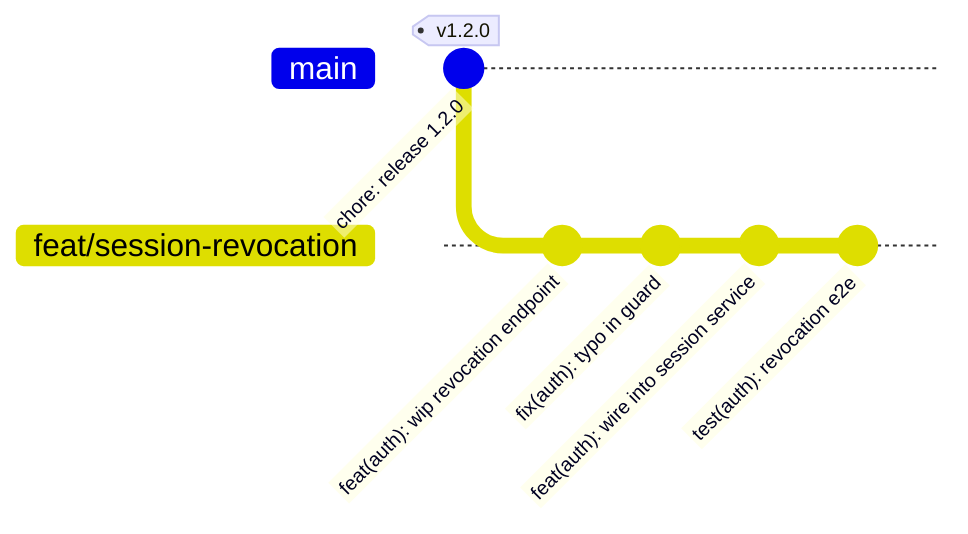
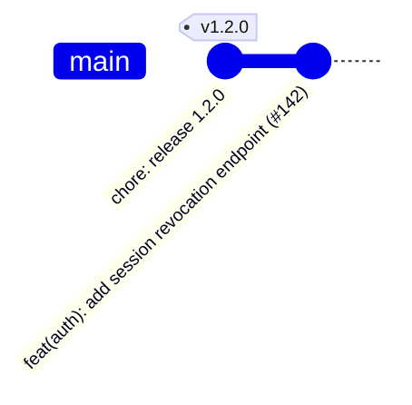
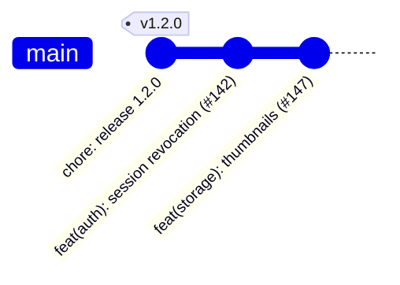
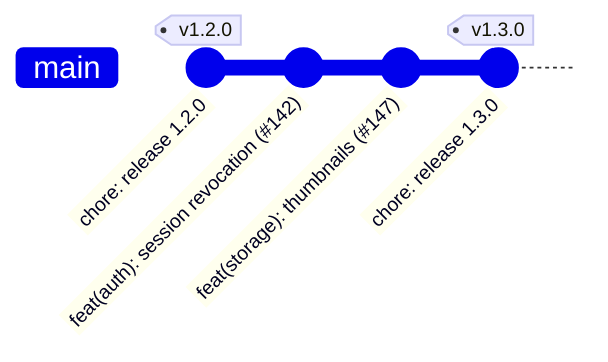
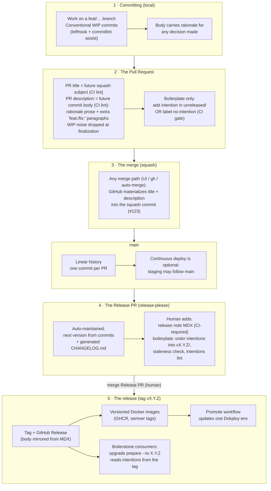

# Contribution and release system — decisions and plan

> Une version française existe : [SPEC.fr.md](./SPEC.fr.md). This file is the reference; keep both in sync when editing.

Status: **implemented on this branch** (slices 1–7). This document records every decision, its rationale, and how the pieces fit together. It exists so we never re-litigate a choice without new information.

The system applies to **the boilerplate repository** and to **consumer projects** generated from it. Differences between the two are marked throughout and summarized in [Boilerplate vs consumer](#boilerplate-vs-consumer).

---

## 0. The story first

Before the rules, here is a normal week on a project using this system. Two developers, Pierrick and Nicolas. The project is at version `1.2.0` and is versioned (a human decides when to release — see D11). Every rule the story relies on is specified in the decisions below.

### Monday — Pierrick works

Pierrick builds session revocation on a branch. He commits as he goes, through his agent. The commits are honest working notes — one is literally a typo fix. Each one passes commitlint (lefthook checks the format locally), but nobody polishes them. They will never reach `main` as commits.



### Tuesday — Pierrick merges

The PR title is `feat(auth): add session revocation endpoint` — CI checked that it is a valid conventional header, because this title is about to become permanent. When the PR is ready, Pierrick tells his agent "finalize this PR". The agent — following the `finalize-pr` skill, on Pierrick's machine — reads the full diff and writes the **PR description** as the future commit body: a short paragraph on *why* revocation uses tombstone checks instead of session deletes. Nothing else — no screenshots, no checklist; review chatter lives in comments. A CI check lints the description and goes green.

Then anyone can merge, from anywhere. The repository is configured so the squash commit message is *always* "PR title + PR description" — the GitHub merge button, `gh`, and auto-merge all produce the same curated commit. There is no message to compose at merge time, so there is no way to fumble it. Pierrick clicks the button. The branch dies.

The four WIP subjects do **not** ride along — "wip endpoint" and "typo in guard" tell a future reader nothing the diff and the rationale don't. Only content that deserves permanence got written into the description, and only the description lands in history.

`main` now has **one** new commit:



Minutes later, a bot PR appears (or updates itself): the **Release PR**, maintained by release-please. It reads the new commit, proposes version `1.3.0` (a `feat` means a minor bump), and regenerates `CHANGELOG.md` with one line — "add session revocation endpoint", linked to commit `#142`. Nobody merges it. It just sits there, staying current.

### Wednesday — Nicolas merges

Nicolas ships thumbnail generation. While testing, he also fixed a real pagination bug — a second, unrelated, consumer-visible change in the same PR. This is the curation call at the heart of the system: out of his five working commits, exactly **two** deserve to exist afterwards. At finalization his agent writes the PR title for the first and puts one conventional paragraph for the second in the description, dropping the rest — the "wip" and "fmt" commits are noise once the history is destroyed.

The squash commit message looks like this (abbreviated):

```
feat(storage): add image thumbnail generation (#147)

Thumbnails are generated at upload time rather than on-the-fly because
the S3 bucket is not fronted by a CDN yet; …

fix(api): correct off-by-one in list endpoint pagination
```



The Release PR updates itself again: still `1.3.0` (two feats and a fix is still a minor), but the changelog now shows **three** lines — revocation, thumbnails, and the pagination fix. Two of them link to the same commit `#147`; that's fine, the fix was declared as its own change.

Meanwhile, staging has been redeployed on every merge. Production hasn't moved — it runs a pinned image, and there is no new version to promote yet.

### Friday — Pierrick releases

The client validated the features on staging; Pierrick decides to ship. He opens the Release PR — the version bump and the changelog are already there. His remaining work is the human part: he writes the release note (`releases/v1.3.0.mdx` in the docs app) — a few sentences on why this release exists and what it changes for users — and adjusts wording where the generated text is dry. A CI check on this PR refuses to merge without the release note. He merges.

Release-please tags `v1.3.0`, creates the GitHub Release (its body mirrored from the MDX), and the tag triggers the Docker build: images `1.3.0`, `1.3`, `latest` land in GHCR. Production still hasn't moved. Pierrick runs the **Promote** workflow from GitHub, picks `production` and `1.3.0`, and Dokploy pulls that image.



Total hand-written material for the whole cycle: two squash bodies and one release note. Everything else — version number, changelog, tag, GitHub Release, images, deploys — was derived. And every "why" is one `git show` away, forever.

*On the boilerplate repository, the same story has one extra beat: Pierrick's PR would have carried a migration intention file (or a `no-intention` label), and the Friday release would include ordering the staged intentions into the `v1.3.0` directory (D10).*

---

## 1. Goals

1. A working semantic versioning system: version numbers computed from the work itself, not from memory or judgment calls.
2. A complete, readable changelog: one line per change since the previous release, fully generated, with links back to the commits.
3. Human release notes: the "why" of a release, written by a person, stored in the repo.
4. The rationale behind every change is captured once, at the moment it is freshest, and never lost.
5. Everything plays well with Docker image pipelines and with the Boilerstone upgrade system (which distributes migration intentions via git tags).

## 2. Core principles

These principles drove every decision below. When in doubt, come back here.

### 2.1 Everything durable lives in the repo

Knowledge must live in files and git history — not in GitHub PRs, GitHub Releases, or any other platform surface. Files and git are trivially reachable for humans and agents alike; platform data needs API plumbing and dies if we move platforms.

GitHub surfaces are allowed as **editing venues** and **mirrors**, never as the source of truth. A PR description is a pencil; the squash commit is the paper.

### 2.2 Commits are the source of truth

The squash (merge) commit message is the single hand-written artifact per PR. Everything else derives from it:

| Zoom level | Artifact | Written by | Contains |
|---|---|---|---|
| Implementation | Squash commit message | Human-guided agent, at PR finalization | What changed and **why** (rationale in the body) |
| Inventory | `CHANGELOG.md` | Generated (release-please) | One line per change, links to commits |
| Release | Release note in the docs app | Human (agent-drafted) | Why this release exists, what the bundle means |

The rationale is written **once**, in the commit body. The changelog does not duplicate it — it links to the commit, and `git show` is one hop away. Duplication creates a second copy that drifts.

### 2.3 Environments consume artifacts, they never own commits

No environment has "its" branch to commit to. `main` produces artifacts (builds, images, tags); each environment points at an artifact stream. Deploy branches, if a host requires one, are fast-forwarded pointers — never workspaces.

---

## 3. Decisions

Each decision below states **what** we chose, **why**, and what we explicitly rejected.

### D1. Conventional Commits, standard types only

We follow the [Conventional Commits 1.0.0](https://www.conventionalcommits.org/en/v1.0.0/) specification: `<type>(<scope>): <description>`, body, footers.

- **Types**: the standard set only (`feat`, `fix`, `docs`, `style`, `refactor`, `perf`, `test`, `build`, `ci`, `chore`, `revert`). No custom types for now.
  - *Why*: fewer rules to teach; and release-please's body-splitting regex only recognizes the standard list, so custom types would silently not count as extra changes in a multi-change PR (verified in release-please source, `src/commit.ts`).
  - *Revisit if*: the generated changelog sections feel wrong and we want types like `remove:` or `security:` mapping to Keep-a-Changelog-style headings.
- **Scopes = tracked domains**. The commit scope list is the same list as the Boilerstone tracked domains (`tooling`, `api`, `frontend`, `auth`, `email`, `storage`, `monitoring`, `ai`, `docker-env`, `ci`), plus `boilerstone` for the upgrade system itself.
  - *Why*: a commit like `feat(auth): …` already tells the release maintainer which domain a migration intention belongs to, and maps onto the `upgrade path` domain filter.
- **Version math**: `fix` → patch, `feat` → minor, `!` or `BREAKING CHANGE:` footer → major.

### D2. `commitlint.config.ts` is the single source of truth for types and scopes

The valid types and scopes live in one exported array in `commitlint.config.ts`. `CONTRIBUTING.md`, the release runbook, and the docs **point to it** and never restate the list.

- *Why*: two copies drift. The runbook currently restates the domain list as prose — that stops.
- **Consumer personalization**: a consumer project edits the scopes array (add `billing`, remove `ai`) without touching any ruleset document. In Boilerstone terms, the config is an `adapt` file; `CONTRIBUTING.md` stays boilerplate-stable.
- Later nice-to-have: `intentions lint` verifies every intention's domain exists in the config.

### D3. Commit bodies carry the rationale

The commit subject describes the change. The commit **body** explains the decision: why this approach, what was rejected, what constraint drove it. A body is **expected** for any commit that makes a decision.

- *Why*: this is the layer where "why did we do this?" gets answered a year later, preventing well-reasoned changes from being reverted out of ignorance. Historically this knowledge lived in PR threads (platform-bound, hard to reach). Agents write good bodies cheaply; the excuse is gone.
- **Hard rule**: never write the token `BREAKING-CHANGE:` in a body unless you mean to force a major release. Release-please matches it anywhere in the body text (verified in source).

### D4. lefthook for local git hooks

`lefthook` runs commitlint on `commit-msg`.

- *Why lefthook over husky*: single binary, fast, one `lefthook.yml`, parallel hooks, no `prepare`-script coupling. Functionally equivalent for our need; taste call.
- Local enforcement is a courtesy/fast-feedback layer. WIP commits disappear at squash; the merged history is protected by CI checks on the PR (D6).

### D5. Squash merge, single `main`, no `develop`

- **Squash merge only.** Merge commits and rebase-merge are disabled in the repo settings.
  - *Why*: linear history (release-please strongly recommends it); one commit per PR makes cherry-picks trivial; the multi-change case is covered by extra conventional paragraphs in the squash body (D6). We accept losing per-WIP-commit bisect granularity — PRs should be small, and the WIP subjects are preserved in the squash body anyway.
- **One `main` branch. Releases are tags, not branches.**
  - *Why no `develop`*: the "stable line" already exists — it is the tag list. Consumers never install from `main` (`install.sh` rejects branches by design). A `develop` branch would duplicate what tags provide, and release-please assumes a single trunk. Git-flow solved parallel release trains we don't have at 3–4 developers.
- **Branch naming** (`feat/…`, `fix/…`): documented convention, loosely enforced. With squash merge it carries no release information.

### D6. From messy WIP commits to the squash commit

This is the most important transition in the system: a branch full of working commits becomes **one curated commit** on `main`. Nothing is promoted from WIP automatically — promotion is a deliberate editorial act at PR finalization.

#### The two histories and their quality bars

- **WIP commits** (on the branch) are the author's working notes. The only bar is commitlint format (enforced by lefthook) so they stay readable; beyond that, "wip", half-steps, and fix-of-the-fix commits are all fine. They are never individually replayed onto `main` — squash erases them as commits, and their *messages* die with them unless their content is deliberately promoted.
- **The squash commit** (on `main`) is the permanent record and the input to versioning. It is *written*, not assembled — and it contains **only what deserves permanence**: the subject, the rationale prose, and one conventional paragraph per additional consumer-visible change. WIP subjects like "wip endpoint" or "fmt" are noise once the history is destroyed; they do not ride along. If a WIP commit captured something worth keeping (a decision, a gotcha), its *content* is promoted into the rationale — the subject line itself never is.

#### What the parser reads (verified in release-please's `src/commit.ts`)

- The **subject line** is parsed as a conventional commit → one changelog entry, counts in version math.
- Any body **paragraph that starts a new line, unbulleted, after a blank line, with a standard type** (`feat: …`, `fix(scope): …`) is parsed as an *additional* commit → its own changelog entry, counts in version math.
- **Bulleted lines (`* fix: typo`) never match.** Useful as a safety fact: if GitHub's auto-generated WIP list ever slips into a merge, it is invisible to the parser — a hygiene problem, not a versioning incident.
- The token `BREAKING-CHANGE:` matches **anywhere** in the body, even mid-prose → forces a major. Hence the always-on warning (6.3).

#### The mechanism: the PR description *is* the future commit body

The naive design — compose the message at merge time — fails in practice: most developers merge from the GitHub UI, and a message composed in a text box at click time is unreviewed and easy to fumble. So the finalization is moved **off the merge click** entirely:

- The repository squash setting is **"Default to pull request title and description"** (D13). Whoever merges — UI button, `gh pr merge --squash`, auto-merge — GitHub materializes the PR title as the commit subject and the PR description, verbatim, as the commit body. There is nothing to compose at merge time.
- Therefore the **PR description is the draft of the permanent record**, and it is held to commit-body standards: rationale prose plus one conventional paragraph per additional change, nothing else. Screenshots, checklists, and review chatter go in PR comments, never the description.
- A CI **description lint** (D7) blocks merge until the description is commit-clean: non-empty, extra conventional paragraphs valid against `commitlint.config.ts`, no unintended `BREAKING-CHANGE:` token.
- This makes the future history **reviewable**: reviewers see in the PR exactly what will land in `git log`, and can request changes on the wording of the rationale like on code. It is also why no merge bot is needed — correctness comes from the repo setting plus the gate, not from who clicks.

The finalization itself runs on the author's machine: the author tells their agent "finalize this PR", and the agent (following the `finalize-pr` skill) updates the title and description via `gh pr edit`. CI only checks; nothing composes messages server-side.

#### The transformation, step by step

1. **During the PR**: the title is kept accurate — it is the future subject (CI lints it as a conventional header, D7). The description can stay a stub until finalization.
2. **At finalization**: the agent reads the full diff — not the WIP subjects, which under-describe the result — and decides the *consumer-visible changes* this PR lands. One primary change = the title. Each additional one = one unbulleted conventional paragraph in the description. Everything else from the WIP history is dropped.
3. **Write the rationale** as description prose (D3): why this approach, what was rejected. Distill what the WIP commit bodies captured along the way — promotion by judgment, not concatenation.
4. **Merge from anywhere**: once review and the description lint are green, the UI button is as safe as the CLI. GitHub appends `(#142)` to the subject: the durable code↔PR link.

#### Worked example

Branch history (working notes, all commitlint-valid):

```
feat(auth): wip revocation endpoint
fix(auth): typo in guard
feat(auth): wire revocation into session service
fix(api): off-by-one in list pagination, found while testing
test(auth): revocation e2e
chore(auth): fmt
```

PR title: `feat(auth): add session revocation endpoint`. Everything below the subject line is the PR description, written at finalization; GitHub materializes both into the squash commit at merge:

```
feat(auth): add session revocation endpoint (#142)

Sessions could only expire naturally; support needed a way to kill a
compromised session immediately. Revocation is a tombstone check on
each request rather than a session-store delete, because Better Auth
caches sessions client-side and a delete alone would not invalidate
already-issued tokens. Rejected: shortening session TTL globally
(punishes every user for the rare compromise case).

fix(api): correct off-by-one in list endpoint pagination
```

Six working commits became a subject, a rationale, and one extra conventional paragraph. The "wip", "typo", "test", and "fmt" subjects were dropped — they describe the *journey*, and the journey is over; the diff and the rationale describe the *result*. The pagination fix survived because it is a real consumer-visible change that deserves its own version impact and changelog line.

What release-please sees: **two** changes — `feat(auth)` (subject) and `fix(api)` (unbulleted paragraph) → minor bump, two changelog lines linking to this commit. The rationale prose is ignored by the parser but permanent in git: `git show` answers "why tombstones?" forever.

What would go wrong without the editing pass: the pagination fix would be invisible to the changelog and the version, and the "why tombstones" decision would exist only in a PR thread.

#### Escape hatch

Release-please honors a `BEGIN_COMMIT_OVERRIDE … END_COMMIT_OVERRIDE` block in the PR description, replacing the commit message for parsing purposes — and it reads the description at parse time, so this works even **after** the merge. That makes it the correction tool for a bad merged message: edit the PR description, add the override block, and the Release PR recomputes — no git surgery. Not a normal-flow tool (it splits the git record from the parsed record); in normal flow, fix the description *before* merging.

### D7. CI gates on every PR

- **PR title lint**: the title must be a valid conventional commit header with a valid scope (e.g. `amannn/action-semantic-pull-request`, fed from `commitlint.config.ts`).
  - *Why the title*: it becomes the squash subject, which is what release-please reads. Linting WIP commits is optional; linting the title is mandatory.
- **PR description lint**: the description must be commit-body-clean (D6): non-empty at merge time, any extra conventional paragraphs valid against `commitlint.config.ts`, no unintended `BREAKING-CHANGE:` token, no obvious non-commit content (images, task lists).
  - *Why*: the description is materialized verbatim into the squash commit body — this gate is what makes the UI merge button safe.
- **WIP-word check**, applied to both the title and the description's conventional paragraphs — the strings that will become changelog entries. Rejects the telltale leftovers of an unfinished finalization: `wip`, `fixup`, `squash`, `tmp`, `temp`, `oops`, `typo`, `fmt`, `lint`, `do not merge`, `wtf`, trailing `…2`/`again`. Word-boundary matches on the entry text only (rationale prose is exempt — "fixed a typo in the guard" is fine there); the list lives next to `commitlint.config.ts` so teams can tune it.
  - *Why*: these are the words that slip from a WIP subject into a permanent changelog line when someone merges without finalizing. Cheap to catch, embarrassing to ship.
- **Intention gate** (boilerplate repo only): the PR must either add a file under `.boilerstone/migration-intentions/unreleased/` or carry the `no-intention` label.
  - *Why a label*: it is a gate, not knowledge — nothing durable is lost if we leave GitHub. Same pattern as the current `no-changelog` label.
- The existing `changelog check` gate is **deleted** — the changelog is generated now (D8).

### D8. release-please owns versioning, tagging, and the changelog

[release-please](https://github.com/googleapis/release-please) runs as a GitHub Action:

- It watches `main`, computes the next version from conventional commits since the last tag, and maintains an open **Release PR** containing the version bump and the regenerated `CHANGELOG.md`.
- Merging the Release PR creates the `vX.Y.Z` tag and the GitHub Release.
- **The changelog is fully generated.** One line per change (per parsed conventional message), grouped by type via `changelog-sections` config, each line linking to its commit. No hand-written entries, no rationale duplication (D3, principle 2.2).
  - *Why we changed our mind*: the old "never generate the changelog" rule predates agent-written commits. With curated squash messages, the generated changelog *is* the curated inventory. The two reasons that used to justify hand-curation (entry granularity, reasons) are now handled at commit-writing time (granularity = the paragraphs the author writes; reasons = commit body, one link away).
- **Version carrier**: the root `package.json` only, single release for the whole monorepo. App manifests are untouched. `extra-files` can sync other files later if something needs the version (a `/version` endpoint, a Docker label).
- **Config lives in the repo** (`release-please-config.json`, `.release-please-manifest.json`) — consistent with principle 2.1.
- **To validate in a throwaway repo before building everything else** (the one open risk): the `changelog-sections` mapping, changelog output quality, and Release PR behavior with our squash conventions.

### D9. Release notes live in the documentation app; GitHub Release is a mirror

- Release notes are MDX pages: `apps/documentation/src/content/docs/releases/vX.Y.Z.mdx`.
  - *Why*: release notes carry intent and human tone — the "why of the release" (e.g. "these five PRs together deliver X"). Part of that context lives outside the repo, so a human must write it (agent-drafted from the changelog and commit bodies, human-finished). And per principle 2.1 they must live in the repo — bonus: the docs app publishes to GitHub Pages, so they're public product communication for free.
- **Written on the Release PR**: the maintainer commits the release note onto the release-please PR before merging. A CI check on the Release PR refuses to merge without `releases/vX.Y.Z.mdx`.
- **At tag time**, a workflow step copies the MDX content into the GitHub Release body. GitHub stays useful (notifications, browsing); the repo stays the authority.
- Release notes ≠ changelog: the changelog is the complete generated inventory; the note is the human story. The note explains the *why of the release*; implementation whys stay in commit bodies.

### D10. Migration intentions are written per PR (boilerplate repo only)

- A PR that changes the boilerplate in a way consumers must adapt to **includes its migration intention** in the same PR: `.boilerstone/migration-intentions/unreleased/slug.md`. No `NN-` order prefix yet.
  - *Why*: the PR author has the context and can guide an agent through writing it; the release maintainer cannot reconstruct five PRs' worth of "why" at release time. The maintainer becomes a plumber, not an author.
  - The code↔intention link is the PR itself: same squash commit contains both. `git log` on the intention file finds it. Optional `pr:` frontmatter field for explicitness.
- Not every PR yields an intention (refactors, boilerplate-internal CI): those PRs take the `no-intention` label (D7) and appear only in the generated changelog.
- **At release time** the maintainer, on the Release PR:
  1. moves `unreleased/*.md` into `migration-intentions/vX.Y.Z/`, assigns `NN-` execution order, wires `requires:` across intentions from different PRs;
  2. checks staleness: diffs `vPREVIOUS..HEAD` against the staged intentions (a later PR may have changed files an earlier intention references);
  3. runs the existing validation (`intentions sync`, `intentions lint`, `upgrade path`).
- Intentions keep their existing format and tag-based distribution. **No hash-based releases**: tags remain the only public anchor; the `unreleased/` staging captures intent at PR time without breaking semver ordering or `upgrade prepare`.
- The release-time inventory is now `git log vPREVIOUS..HEAD` + staged intentions (the changelog used to play this role; the generated one serves it equally well).

### D11. Two CD modes, deployment decorrelated from release

Deployment and release are independent triggers on the same pipeline:

- Every merge to `main` → build/deploy the "latest main" artifact (SHA-tagged image, or Dokploy builds from the branch).
- Every release tag → version-tagged Docker images for each runnable app (API and frontends) via `docker/metadata-action` semver rules (`1.2.3`, `1.2`, `latest`).

Two modes. Configuration, not different pipelines:

| Mode | Versioning | Release trigger | Typical stage |
|---|---|---|---|
| **Without versions** | commitlint only, no versions | none (no release-please) | early project; often only staging exists; hook the host to `main` and let it build |
| **Versioned** | full semver | **manual**: a human merges the Release PR | production gate; merging to `main` publishes an artifact, it does not update production |

**Rejected: auto-merge of the Release PR** (the old "level 2"). A green Release PR is not consent to ship. Checks mean the PR is *allowed* to merge, not that the team wants this bundle in production. We will not add a workflow, PAT, or `RELEASE_LEVEL` flag that squash-merges it. If a project still deploys every merge to production, it stays **without versions** until it is ready for the human gate.

**Rejected: both staging and production follow `latest`.** That image tag is the last *release*, and both environments would move together. Promotion is a separate signal per environment.

**Rejected: versioned API images while frontends still build from a branch.** Production would then pin the backend and float the frontend. Every runnable app is an image; Promote sends the same version to all of them.

How an environment consumes artifacts is a **recipe**, not a rule:

- **Without versions**: hook the environment to `main` and let the host build.
- **Versioned, recommended**: staging may follow `main` (so unreleased work can be validated). Production runs a specific versioned tag for every app (API and frontends). After the Release PR merge, the **Promote** workflow (`.github/workflows/promote.yml`) tells Dokploy to pull that version. Staging and production are different GitHub Environments, so they move independently. Do not edit the version by hand in Dokploy each time.
- If a PaaS still needs a branch to watch, `deploy/<env>` can exist as a **fast-forwarded pointer** to the tag — never committed to directly (principle 2.3). That is an escape hatch, not the default.

- **Dokploy modes**: without versions = Dokploy watches the branch and builds. Versioned = GitHub builds GHCR images (the existing `push-to-ghcr.yml`, switched to trigger on `v*` tags), Dokploy pulls them, Promote updates the image tag through the Dokploy API. The moment a project needs environments on *different* versions is the moment it should switch to images.
- **Defaults**: new consumer projects start without versions. The boilerplate repo itself is versioned (its Release PR is where intentions are ordered and the release note written).

### D12. Selective shipping: feature flags first, release-branch cherry-pick as escape hatch

The client-wants-B-without-A problem (both merged, A must not ship):

1. **Preferred: feature flags**, as a lightweight convention — an env-var check (`FEATURE_X=true`) read in one place. One helper, one doc page; not a flag platform. A merges but ships dark.
2. **Escape hatch: release branch.** Branch from the last release tag, cherry-pick B's squash commit (trivial — one commit per PR), cut a patch release from that branch. Release-please supports releasing from a non-`main` branch. `main`'s next normal release includes both A and B and the branch dies.
3. Delaying the merge is acceptable occasionally, bad as a habit.

The versioned release gate removes most *other* cherry-picking: merging no longer means deploying to production, so unfinished sets can merge freely.

### D13. GitHub repository settings (the part that can't live in code)

A documented setup checklist, optionally scripted once with `gh api` so configuring a new consumer repo is one command:

- Squash merge only (disable merge commits and rebase merge).
- Default squash message: **"pull request title and description"** — the load-bearing setting (D6): it makes every merge path (UI, CLI, auto-merge) materialize the curated title + description into the commit, with nothing to compose at click time.
- Labels: `no-intention` (boilerplate), plus any release-please labels.
- Branch protection on `main`: required checks (CI, PR title lint, intention gate where applicable).
- GitHub Environments `staging` and `production` for the Promote workflow, with Dokploy secrets added in the UI. Optional required reviewers on `production`.

---

## 4. The flow



Stage-by-stage summary:

1. **Committing**: conventional WIP commits with rationale in bodies. Tools: commitlint + lefthook locally; an agent skill for writing commit messages (subject conventions, body rules, the `BREAKING-CHANGE:` trap).
2. **Creating your PR**: title is the future squash subject — write it as the conventional header it will become. Keep PRs small and single-purpose. The description is held to commit-body standards (screenshots and checklists go in comments). Boilerplate repo: include the migration intention or the `no-intention` label. Don't: bundle unrelated changes, write a vague title and plan to "fix it at merge".
3. **Finalization, then the merge**: the editorial moment (D6) happens *before* merge, on the author's machine — the agent reads the diff, decides the consumer-visible changes (title + one unbulleted conventional paragraph each), distills the WIP bodies into rationale prose in the PR description, drops the rest. Once the description lint is green, any merge path (UI, `gh`, auto-merge) produces the same curated commit.
4. **The Release PR**: release-please keeps it current (version + changelog). Humans use it as the release workspace: release note, intention ordering, validations. A human merges it. Green checks are not auto-ship.
5. **The release**: tag, mirrored GitHub Release, versioned images. Production does not move until someone runs Promote. For the boilerplate, the tag is also what Boilerstone consumers upgrade against.

---

## 5. Boilerplate vs consumer

| Piece | Boilerplate repo | Consumer project |
|---|---|---|
| Conventional commits, commitlint, lefthook | ✔ | ✔ (edits the scopes array) |
| PR title + description lint | ✔ | ✔ |
| Intention gate (`unreleased/` or `no-intention`) | ✔ | ✘ (no intentions machinery — stripped at generation) |
| release-please | ✔, versioned (human merge) | Optional: off (without versions) or on (human merge) |
| Generated `CHANGELOG.md` | ✔ | ✔ when versioned |
| Release notes in docs app | ✔ (`apps/documentation/…/releases/`) | ✔ when versioned (their own product story) |
| Release-time intention plumbing on the Release PR | ✔ | ✘ |
| Tag-triggered GHCR images | ✔ (dogfood) | Recommended when versioned |
| Promote workflow (Dokploy image update) | optional | Recommended when versioned and Dokploy pulls images |
| `CONTRIBUTING.md` | ✔ | ✔ shipped; personalize scopes/domains via config, not prose |
| GitHub settings checklist / script | ✔ | ✔ (run once at project setup) |

The whole feature ships to consumers as a normal boilerplate release with a `ci`-domain intention — dogfooding the system it describes.

---

## 6. Agent enablement — guardrails, documents, rules, skills

The team commits mostly through agents, so the system must make agents correct **by construction**, not by hoping they read the docs. Four layers, ordered by reliability:

### 6.1 Guardrails: machines catch what nobody read

An agent that read nothing must still be stopped by tooling, and every rejection message must state the fix — **error messages are prompts**. The current changelog gate already does this well ("Add your entry under `## [Unreleased]`, or label the PR `no-changelog`"); every new gate follows the same style.

| Guardrail | Where | Message must say |
|---|---|---|
| commitlint via lefthook | local `commit-msg` | which rule failed; valid types/scopes live in `commitlint.config.ts` |
| PR title lint | CI on every PR | "the title becomes the squash subject — write it as `type(scope): description`; valid scopes: …" |
| PR description lint | CI on every PR | "the description becomes the commit body verbatim — rationale prose + valid conventional paragraphs only; move screenshots/checklists to comments" |
| WIP-word check | CI on every PR (title + conventional paragraphs) | "'wip' would land in the changelog — finalize the PR: rewrite the title/paragraph to describe the result" |
| Intention gate (boilerplate) | CI on every PR | "add an intention under `.boilerstone/migration-intentions/unreleased/` or apply the `no-intention` label" |
| Release-note check | CI on the Release PR | "add `apps/documentation/src/content/docs/releases/vX.Y.Z.mdx` before merging" |
| `intentions lint` / `sync` | CI on the Release PR (boilerplate) | existing messages |

One trap no linter can catch: a stray `BREAKING-CHANGE:` token in a commit body is *valid* syntax that silently forces a major release. That is why it appears in the always-on rule (6.3), not just in `CONTRIBUTING.md`.

### 6.2 Canonical documents: one canon per stage, never restated

Same anti-drift rule as D2 — skills and rules **point** to these documents and never duplicate their content:

| Stage | Canonical document |
|---|---|
| Commits, PRs, squash merge | `CONTRIBUTING.md` (root, shipped to consumers) |
| Boilerplate release | `.boilerstone/docs/release-maintainer-runbook.md` (rewritten) |
| Consumer release, CD levels | `apps/documentation/src/content/docs/references/1_release_and_versionning.mdx` |
| Intention writing | `.boilerstone/migration-intentions/TEMPLATE.md` + its runbook section |
| Design rationale | the new explanation page (from this spec's sections 2–3) |

### 6.3 Always-on rules: one pointer, one warning

`AGENTS.md`, `CLAUDE.md`, and `.cursor/rules/0_common.mdc` gain two lines, no more (always-on context is a budget):

1. "Before committing or opening a PR, read `CONTRIBUTING.md` and follow it."
2. "Never write the token `BREAKING-CHANGE:` in a commit message unless you intend to force a major release."

Everything else is either enforced by a guardrail (6.1) or documented in the canon (6.2). Deliberately **no always-on summary of the commit rules**: commitlint gives immediate corrective feedback, which teaches faster than prose.

### 6.4 Skills: thin shims for the ceremonies

Committed in both `.claude/skills/` and `.cursor/skills/`, following the existing boilerstone shim pattern (trigger description in frontmatter, "the canon lives at X — read it first", preflight, quick map, non-negotiable guardrails). Skills exist for *ceremonies* — multi-step, occasional procedures. Routine actions get rules and guardrails instead.

| Skill | Repos | Trigger | Job |
|---|---|---|---|
| `finalize-pr` (new) | boilerplate + consumers | "finalize / merge this PR", "prepare for merge" | Run the D6 transformation: read the **full diff** (not the WIP subjects) to identify consumer-visible changes; set the PR title (valid conventional header, valid scope) and write the PR description as the future commit body — rationale prose distilled from the WIP commit bodies, one **unbulleted** conventional paragraph per additional change, everything else from the WIP history dropped; scan for accidental `BREAKING-CHANGE:`. Applies both via `gh pr edit`. Boilerplate: verify intention-or-label. Merging afterwards is safe from any path (UI, `gh`, auto-merge). |
| `boilerstone-intention` (new) | boilerplate only | "write the migration intention (for this PR)" | Write one bounded intention from `TEMPLATE.md` into `unreleased/` **within the current PR**, no `NN-` prefix. Points to the runbook's intention-authoring section. |
| `boilerstone-release` (rewritten) | boilerplate only | "prepare the release", "work the Release PR" | Operate on the release-please Release PR: move `unreleased/*.md` into `vX.Y.Z/` with `NN-` order and `requires:`; staleness-check intentions against `git diff vPREVIOUS..HEAD`; draft the release note MDX from changelog + commit bodies; run validations. **Never tags, never merges the Release PR** — human's final act. |
| `project-release` (new) | consumers, versioned | "prepare the release" | Consumer flavor of the above minus intentions: draft the release note, verify Release PR checks. **Never merge.** |
| `boilerstone-init`, `boilerstone-upgrade` | unchanged | — | — |

Deliberately **no `commit` skill**: committing happens dozens of times a day, and skills trigger unreliably at that frequency. The always-on pointer (6.3), `CONTRIBUTING.md`, and commitlint's corrective errors cover it.

### 6.5 Repo policy

The README's AI-practice section ("do not add rules to the repo") extends its committed-shim exception to the skills above. Same constraint as the boilerstone shims: thin, pointing to the canon, updated in the same PR whenever the canon's commands or rules change (the runbook already imposes this for CLI changes — same discipline here).

---

## 7. What changes in the current repo

**Deleted**
- `changelog check` and `changelog release` CLI commands (`.boilerstone/cli/boilerplate.ts`) and the `Changelog 📜` workflow (`.github/workflows/changelog.yml`). Replaced by the generated changelog + PR title lint + intention gate.
- Hand-maintained `CHANGELOG.md` discipline (the file becomes generated; existing released sections are kept as history).

**Added**
- `CONTRIBUTING.md`, `commitlint.config.ts`, `lefthook.yml`.
- Workflows: PR title lint, intention gate, release-please, release-note check on the Release PR, GitHub-Release mirror step, Promote.
- `apps/documentation/src/content/docs/releases/` collection.
- `.boilerstone/migration-intentions/unreleased/` staging directory.
- Skills: `finalize-pr`, `boilerstone-intention`, `project-release` (in `.claude/skills/` and `.cursor/skills/`, per section 6.4).
- Two always-on lines in `AGENTS.md`, `CLAUDE.md`, `.cursor/rules/0_common.mdc` (per section 6.3).
- GitHub settings checklist (+ optional `gh` script).
- Feature-flag convention (helper + doc page).

**Rewritten**
- `.boilerstone/docs/release-maintainer-runbook.md` — much shorter. The Release PR does the plumbing (version, changelog, tag). Remaining human steps: order and staleness-check intentions, write the release note, smoke test. The "changelog discipline" section and version-picking section disappear (automated); the release-branch escape hatch (D12) gets a page. Gains an intention-authoring section (the canon `boilerstone-intention` points to).
- `.claude/skills/boilerstone-release/` and its `.cursor` twin — re-pointed at the new runbook flow (section 6.4).
- README AI-practice section — shim exception extended to the new skills (section 6.5).
- `apps/documentation/src/content/docs/references/1_release_and_versionning.mdx` — two modes, recipes for environments, Promote workflow, Dokploy.
- A new explanation page alongside `0_designphilosophy.mdx` — the durable rationale (this document's section 2 and 3, consumer-facing).
- `push-to-ghcr.yml` — trigger on `v*` tags with semver image tagging.

---

## 8. Implementation plan

Ordered so each slice works without the ones after it. Each slice ships its own agent surface (guardrail messages, skill, rule lines) in the same PR — never later.

1. **Contribution baseline**: `CONTRIBUTING.md`, `commitlint.config.ts` (types + scopes), `lefthook.yml`, PR title + description lint workflow including the WIP-word check, GitHub settings checklist. Agent surface: the two always-on rule lines (6.3) and the `finalize-pr` skill (6.4). No release behavior changes yet.
2. **release-please prototype** in a throwaway repo: validate `changelog-sections` mapping, changelog quality with our squash conventions, Release PR behavior, tag creation. *This is the one open risk — do it before wiring anything for real.*
3. **release-please for real**: config files, workflow, root `package.json` as version carrier. Delete the changelog CLI commands and workflow. Convert `CHANGELOG.md` to generated. Retire the changelog references from the old `boilerstone-release` skill.
4. **Release notes flow**: `releases/` docs collection, CI check on the Release PR, GitHub-Release mirror step. Agent surface: `project-release` skill.
5. **Intentions staging**: `unreleased/` directory, intention gate workflow, release-time move/ordering step (CLI helper if useful), runbook rewrite. Agent surface: `boilerstone-intention` skill, `boilerstone-release` skill rewrite, `finalize-pr` intention preflight.
6. **CD modes**: tag-triggered GHCR images, two-mode documentation (without versions vs versioned human merge), Promote workflow for Dokploy, `1_release_and_versionning.mdx`, feature-flag convention. No auto-merge of the Release PR.
7. **Ship it**: release the whole feature as a boilerplate version with its `ci` intention.

## 9. Open items

### Prototype validation (step 2) — done 2026-08-26

Throwaway repo: `RDeluxe/release-please-prototype-ae7a6d` (private). Deletion failed — the `gh` token lacks the `delete_repo` scope. A human should delete https://github.com/RDeluxe/release-please-prototype-ae7a6d (`gh auth refresh -s delete_repo` then `gh repo delete RDeluxe/release-please-prototype-ae7a6d --yes`). Seeded at `1.0.0` with tag `v1.0.0`. Three squash-style commits on `main`. `googleapis/release-please-action@v4` on `push` to `main` with `contents: write` and `pull-requests: write`. The Action created Release PR #1 and, after a human squash-merge, created the GitHub Release.

**Can the generated changelog replace a curated Keep-a-Changelog file?** Yes, as the inventory. With the mapping below it is readable: one line per parsed change, grouped under Added / Fixed / Documentation, each line linked to its commit. It does not replace the human release note (D9). Fallback (release-please for version math only) is not needed.

**Version bump observed:** `1.0.0` → `1.1.0` (the `feat` subject). Changelog excerpt from the Release PR / `CHANGELOG.md`:

```
## [1.1.0] (...) (2026-08-26)

### Added
* **auth:** add session revocation endpoint (6c60084)

### Fixed
* **api:** correct off-by-one in list endpoint pagination (6c60084)

### Documentation
* **api:** clarify pagination notes (a087474)
```

**Squash-convention parse results (matches D6):**

| Input | Result |
|---|---|
| Subject `feat(auth): add session revocation endpoint` | One Added line; counts in version math |
| Rationale prose ("Sessions could only expire naturally…") | Ignored by the parser |
| Extra unbulleted `fix(api): correct off-by-one…` | Own Fixed line; same SHA as the feat |
| `chore(ci): tweak workflow timeouts` | Hidden (not in the changelog) |
| Bulleted `* fix: typo in the example` | Not a changelog line |

**Tag / GitHub Release:** merging the Release PR (squash) produced commit `chore(main): release rp-proto 1.1.0 (#1)`. The next Action run created tag `rp-proto-v1.1.0` and GitHub Release `rp-proto: v1.1.0`. The compare URL pointed at `rp-proto-v1.0.0`, which does not exist (baseline was `v1.0.0`). **Slice 3 must set `"include-component-in-tag": false`** so tags are `vX.Y.Z` (what `install.sh` and Boilerstone already expect). Squash-merging the Release PR is fine: release-please still tagged and published.

**Final `changelog-sections` mapping** (keep this; output was clean):

```json
"changelog-sections": [
  { "type": "feat", "section": "Added" },
  { "type": "fix", "section": "Fixed" },
  { "type": "perf", "section": "Performance" },
  { "type": "revert", "section": "Reverted" },
  { "type": "docs", "section": "Documentation" },
  { "type": "refactor", "section": "Changed" },
  { "type": "ci", "section": "CI", "hidden": true },
  { "type": "chore", "section": "Chore", "hidden": true },
  { "type": "test", "section": "Tests", "hidden": true },
  { "type": "style", "section": "Style", "hidden": true },
  { "type": "build", "section": "Build", "hidden": true }
]
```

Visible: feat, fix, perf, revert, docs, refactor. Hidden: ci, chore, test, style, build.

**Auto-merge of the Release PR (old level 2) — rejected.** A green PR is allowed to merge, not requested to ship. No `allow_auto_merge`, no PAT merge workflow, no `RELEASE_LEVEL` variable. A human merges the Release PR. The prototype still showed that a `GITHUB_TOKEN` merge would skip the tag job — that remains a reason never to let a bot merge it with the default token.

**Leftover notes from the prototype (still true):**

1. Set `include-component-in-tag: false` or tags will be `<package-name>-vX.Y.Z` and compare links will be wrong.
2. `BREAKING-CHANGE:` was not re-tested in the throwaway repo (already verified in source, D3/D6).

### Still open

- Whether the release-time intention move (unreleased → `vX.Y.Z/` with `NN-` prefixes) deserves a small CLI command or stays manual.
