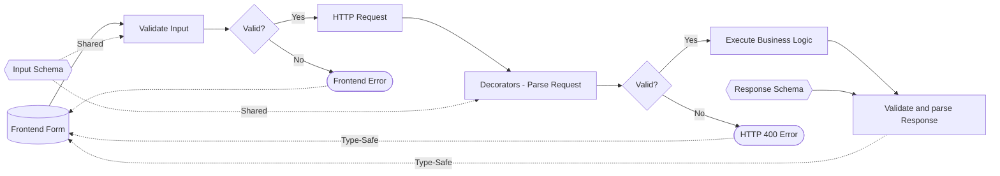

# Request Validation

Type-safe request validation powered by Zod schemas.

## Table of Contents

- [Quick Start](#quick-start)
- [Architecture](#architecture)
- [Query Parameters Validation](#query-parameters-validation)
- [Form Data Validation](#form-data-validation)
- [JSON Body Validation](#json-body-validation)
- [URL Parameter Validation](#url-parameter-validation)
- [Route Response Validation](#route-response-validation)
- [Standalone Pipe Usage](#standalone-pipe-usage)
- [Error Handling](#error-handling-1)
- [Best Practices](#best-practices)
- [Real-World Examples](#real-world-examples)

## Motivation

This validation library is designed to provide end-to-end type safety in a monorepo structure, where schemas are shared between the frontend and backend. However, it can also be used standalone in any NestJS application.

### Data Flow



### Key Benefits

1. **Single Source of Truth**
   - Schemas defined once, used everywhere
   - Shared between frontend and backend
   - Automatic type generation

2. **Type Safety**
   - Full TypeScript support
   - Compile-time validation
   - Runtime validation
   - Error type inference

3. **Developer Experience**
   - Automatic API documentation
   - IDE autocompletion
   - Consistent validation rules
   - Reduced boilerplate

### Example Monorepo Structure

```
monorepo/
├── apps/
│   ├── api/
│   │   ├── src/
│   │   │   ├── users/
│   │   │   │   ├── users.controller.ts
│   │   │   │   └── users.service.ts
│   │   │   └── main.ts
│   │   └── package.json
│   └── frontend/
│       ├── src/
│       │   ├── features/
│       │   │   └── users/
│       │   │       ├── CreateUser.tsx
│       │   │       └── api.ts
│       │   └── main.tsx
│       └── package.json
└── packages/
    └── dtos/
        ├── src/
        │   └── users/
        │       ├── create-user.schema.ts
        │       └── update-user.schema.ts
        └── package.json
```

### Usage in Monorepo

```tsx
// packages/dtos/src/users/user.schema.ts
export const CreateUserSchema = z.object({
  email: z.string().email(),
  name: z.string()
})

export const UserResponseSchema = CreateUserSchema.extend({
  id: z.string().uuid(),
  createdAt: z.string().datetime()
})

type CreateUserDTO = z.infer<typeof CreateUserSchema>
type User = z.infer<typeof UserResponseSchema>

// apps/frontend/src/features/users/CreateUser.tsx
function CreateUserForm() {
  const form = useForm({
    resolver: zodResolver(CreateUserSchema)
  })

  const onSubmit = async (data: CreateUserDTO) => {
    const user = await api.post<User>('/users', data)
    // user is typed as User, validated by UserResponseSchema
  }

  return (
    <form onSubmit={form.handleSubmit(onSubmit)}>
      {/** form fields */}
    </form>
  )
}
```

```typescript
// apps/api/src/users/users.controller.ts
@Controller('users')
class UsersController {
  @TypedRoute.Post(User)
  async create(
    @TypedBody(CreateUserSchema) data: CreateUserDTO
  ): Promise<User> {
    const user = await this.service.create(data)
  }
}
```

## Quick Start

### Installation

```bash
pnpm add @sun-agenda/nest-rest-helpers zod
```

### Basic Usage

```typescript
import { TypedBody, TypedParam, TypedQuery, TypedQueryObject } from '@sun-agenda/nest-rest-helpers'
import { z } from 'zod'

const UserSchema = z.object({
  id: z.string().uuid(),
  email: z.string().email(),
  name: z.string()
})

const CreateUserSchema = User.extend({
  password: z.string().min(8)
})

type User = z.infer<typeof UserSchema>
type CreateUserDTO = z.infer<typeof CreateUserSchema>

@Controller('users')
class UsersController {
  @TypedRoute.Post(UserSchema)
  async create(@TypedBody(CreateUserSchema) user: CreateUserDTO): Promise<User> {
    return this.service.create(user)
  }

  @TypedRoute.Get(':id', UserSchema)
  async getById(@TypedParam('id', 'uuid') id: string): Promise<User> {
    return this.service.findById(id)
  }
}
```

## Architecture

### Validation Flow

```mermaid
graph LR
    A[HTTP Request] --> B[NestJS Pipeline]
    B --> C{Decorator Type}
    C -->|@TypedQuery| D[Parse Query Param]
    C -->|@TypedQueryObject| E[Parse Query Object]
    C -->|@TypedFormBody| F[Parse Form Data]
    C -->|@TypedParam| G[Parse URL Param]
    C -->|@TypedBody| H[Parse JSON Body]
    D & E & F & G & H --> I[Zod Schema]
    I -->|Valid| J[Controller Method]
    I -->|Invalid| K[ZodValidationException]
    J -->|Validate| L[Response]
```

### Components

1. **ZodValidationPipe**
   - Base validation pipe using Zod schemas
   - Used internally by decorators
   - Can be used standalone for simple validations
   - Throws `ZodValidationException` on validation failure

2. **TypedBody Decorator**
   - Validates JSON request bodies
   - Requires `application/json` content type
   - Handles nested object structures
   - Full schema validation with type inference

3. **TypedQuery Decorator**
   - Validates single query parameters
   - Supports array parameters
   - Handles type coercion
   - Optional parameters support

4. **TypedQueryObject Decorator**
   - Validates entire query object
   - Full schema validation
   - Type inference from schema

5. **TypedFormBody Decorator**
   - Validates form-urlencoded bodies
   - Handles content-type verification
   - Converts URLSearchParams to object

6. **TypedParam Decorator**
   - Validates URL parameters
   - Built-in type converters
   - Custom validation support
   - Path parameter safety

7. **TypedRoute Decorator**
   - Validates response data
   - Automatically removes extra properties
   - Type inference from Zod schemas
   - Throws `ZodSerializationException` on validation failure

## Query Parameters Validation

Use `@TypedQuery` for individual parameters:

```typescript
@Controller('search')
class SearchController {
  @Get()
  async search(
        @TypedQuery('q', z.string().min(2)) query: string,
        @TypedQuery('tags', z.string(), { array: true }) tags: string[],
        @TypedQuery('page', z.coerce.number().int().positive(), { optional: true }) page?: number,
  ) {
    return this.service.search(query, tags, page)
  }
}
```

### Query Object Validation

Use `@TypedQueryObject` for full query objects:

```typescript
const SearchQuery = z.object({
  q: z.string().min(2),
  tags: z.array(z.string()).optional(),
  page: z.coerce.number().int().positive().optional(),
})

@Controller('search')
class SearchController {
  @Get()
  async search(@TypedQueryObject(SearchQuery) query: z.infer<typeof SearchQuery>) {
    return this.service.search(query)
  }
}
```

### Form Data Validation

Use `@TypedFormBody` for form-urlencoded bodies:

```typescript
const CreateArticleSchema = z.object({
  title: z.string().min(3),
  content: z.string(),
  tags: z.array(z.string()),
})

@Controller('articles')
class ArticlesController {
  @Post()
  async create(@TypedFormBody(CreateArticleSchema) data: z.infer<typeof CreateArticleSchema>) {
    return this.service.create(data)
  }
}
```

## JSON Body Validation

Use `@TypedBody` for validating JSON request bodies. This decorator specifically handles `application/json` content type.

### Basic Usage

```typescript
const CreateUserSchema = z.object({
  email: z.string().email(),
  password: z.string().min(8),
  profile: z.object({
    name: z.string(),
    age: z.number().int().min(18)
  })
})

@Controller('users')
class UsersController {
  @Post()
  async create(@TypedBody(CreateUserSchema) data: z.infer<typeof CreateUserSchema>) {
    return this.service.create(data)
  }
}
```

### Key Differences from @TypedFormBody

1. **Content Type**
   - `@TypedBody`: Requires `application/json`
   - `@TypedFormBody`: Requires `application/x-www-form-urlencoded`

2. **Data Structure**
   - `@TypedBody`: Handles nested JSON objects natively
   - `@TypedFormBody`: Processes flat key-value pairs from form data

3. **Data Parsing**
   - `@TypedBody`: Uses request body directly
   - `@TypedFormBody`: Converts URLSearchParams to object

### When to Use Each

- Use `@TypedBody` when:
  - Working with JSON APIs
  - Handling complex nested data structures
  - Building REST APIs
  - Integrating with frontend frameworks

- Use `@TypedFormBody` when:
  - Processing HTML form submissions
  - Working with legacy systems
  - Handling simple key-value data
  - Building traditional web applications

Example of the same endpoint using both decorators:

```typescript
const UserSchema = z.object({
  name: z.string(),
  age: z.number()
})

@Controller('users')
class UsersController {
  // For JSON requests
  @Post('json')
  async createJson(@TypedBody(UserSchema) data: z.infer<typeof UserSchema>) {
    return this.service.create(data)
  }

  // For form-urlencoded requests
  @Post('form')
  async createForm(@TypedFormBody(UserSchema) data: z.infer<typeof UserSchema>) {
    return this.service.create(data)
  }
}
```

## URL Parameter Validation

Use `@TypedParam` for validating and transforming URL parameters in route paths.

### Basic Usage

```typescript
@Controller('articles')
class ArticlesController {
  @Get(':id/comments/:page')
  async getComments(
    @TypedParam('id', 'uuid') id: string,
    @TypedParam('page', 'positiveInt') page: number
  ) {
    return this.service.getComments(id, page)
  }
}
```

### Built-in Parameter Types

The decorator supports several built-in parameter types:

- `string`: Basic string validation
- `number`: Coerces and validates numbers
- `boolean`: Coerces and validates booleans
- `uuid`: Validates UUID strings
- `int`: Coerces and validates integers
- `positiveInt`: Coerces and validates positive integers

### Custom Parameter Validation

For more complex validation needs, use `createTypedParam` to create custom parameter validators:

```typescript
const CodeParam = createTypedParam(
  z.string()
    .min(3)
    .max(10)
    .regex(/^[A-Z]+$/)
)

@Controller('products')
class ProductsController {
  @Get(':code')
  async getByCode(@CodeParam('code') code: string) {
    return this.service.findByCode(code)
  }
}
```

### Error Handling

The decorator will:
- Throw `BadRequestException` if the parameter is missing
- Throw `ZodValidationException` if validation fails
- Include detailed error messages in the response

Example error response:
```json
{
  "statusCode": 400,
  "message": "Validation failed",
  "errors": [
    {
      "code": "invalid_string",
      "validation": "uuid",
      "path": ["id"],
      "message": "Invalid uuid"
    }
  ]
}
```

## Route Response Validation

Use `TypedRoute` decorators to validate response data against Zod schemas

- Runtime validation of response data
- Automatic removal of extra properties not in schema
- Type inference from Zod schemas
- Throws `ZodSerializationException` if validation fails
- Supports all HTTP methods (GET, POST, PUT, PATCH, DELETE)
- Can validate arrays and nested objects

```typescript
import { TypedRoute } from '@sunagenda/nest-rest-helpers'
import { z } from 'zod'

const UserSchema = z.object({
  id: z.string().uuid(),
  name: z.string(),
  email: z.string().email()
})

@Controller('users')
export class UsersController {
  @TypedRoute.Get('/', UserSchema)
  async getUser(): Promise<z.infer<typeof UserSchema>> {
    return {
      id: '123e4567-e89b-12d3-a456-426614174000',
      name: 'John',
      email: 'john@example.com'
    }
  }

  @TypedRoute.Get('/many', z.array(UserSchema))
  async getUsers(): Promise<z.infer<typeof UserSchema>[]> {
    return [
      {
        id: '123e4567-e89b-12d3-a456-426614174000',
        name: 'John',
        email: 'john@example.com'
      }
    ]
  }
}
```

### Important notes

This decorator is only useful to ensure that the data you return to your client is valid and stripped from extra properties that may come from your database.

However it's meant to be used in addition to a proper return type: you should still use some sort of `entityToDTO` function to transform your entity into a DTO, which will then be validated by this decorator.

### Available Decorators

- `@TypedRoute.Get(path?, schema?)`
- `@TypedRoute.Post(path?, schema?)`
- `@TypedRoute.Put(path?, schema?)`
- `@TypedRoute.Patch(path?, schema?)`
- `@TypedRoute.Delete(path?, schema?)`

### Error Handling

If validation fails, a `ZodSerializationException` is thrown with detailed error information:

```json
{
  "statusCode": 500,
  "message": "Serialization failed",
  "errors": [
    {
      "code": "invalid_type",
      "expected": "string",
      "received": "number",
      "path": ["email"],
      "message": "Expected string, received number"
    }
  ]
}
```

## Standalone Pipe Usage

Use `ZodValidationPipe` directly for simple cases:

```typescript
@Controller('articles')
class ArticlesController {
  @Post()
  async create(
    @Body(new ZodValidationPipe(CreateArticleSchema))
    data: z.infer<typeof CreateArticleSchema>
  ) {
    return this.service.create(data)
  }
}
```

## Error Handling

All validation failures throw a `ZodValidationException` which:
- Extends NestJS's `BadRequestException`
- Returns HTTP 400 status code
- Includes "Validation failed" message
- Contains detailed Zod validation errors

Example error response:
```json
{
  "statusCode": 400,
  "message": "Validation failed",
  "errors": [
    {
      "code": "too_small",
      "minimum": 2,
      "type": "string",
      "path": ["q"],
      "message": "String must contain at least 2 character(s)"
    }
  ]
}
```

## Best Practices

### Schema Organization

1. **Centralize Schemas**
   - Keep schemas in dedicated files
   - Group related schemas together
   - Export reusable schema parts

```typescript
// schemas/user.schema.ts
export const UserBaseSchema = z.object({
  email: z.string().email(),
  name: z.string()
})

export const CreateUserSchema = UserBaseSchema.extend({
  password: z.string().min(8)
})

export const UpdateUserSchema = UserBaseSchema.partial()
```

2. **Schema Composition**
   - Build complex schemas from simpler ones
   - Use schema methods like `.extend()`, `.pick()`, `.omit()`
   - But be careful, as those methods are costly
   - Share validation logic through custom refinements

3. **Type Inference**
   - Use `z.infer<>` for TypeScript types
   - Export inferred types for reuse
   - Keep schema as single source of truth

## Real-World Examples

### Combining Decorators

Here's an example showing how to combine different decorators in a real-world scenario:

```typescript
const ListArticlesQuery = z.object({
  page: z.coerce.number().int().positive().optional(),
  tags: z.array(z.string()).optional(),
  sort: z.enum(['date', 'title', 'popularity']).optional()
})

@Controller('categories')
class CategoriesController {
  @Get(':categoryId/articles')
  async listArticles(
    @TypedParam('categoryId', 'uuid') categoryId: string,
    @TypedQueryObject(ListArticlesQuery) query: z.infer<typeof ListArticlesQuery>,
    @TypedQuery('include', z.string(), { array: true, optional: true }) include?: string[]
  ) {
    return this.service.listArticles({
      categoryId,
      ...query,
      include
    })
  }

  @Post(':categoryId/articles')
  async createArticle(
    @TypedParam('categoryId', 'uuid') categoryId: string,
    @TypedFormBody(CreateArticleSchema) data: z.infer<typeof CreateArticleSchema>
  ) {
    return this.service.createArticle(categoryId, data)
  }
}
```

# Credits

This lib was inspired by the amazing work of [Samchon](https://github.com/samchon) and his Typia and Nestia projects.
